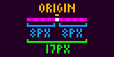
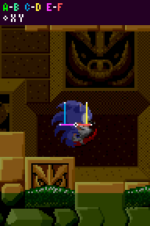

# Sonic Physics Guide
***Transcribed and Arranged to Markdown/PDF format by DiSKO***

---
## Table of Contents
1. [Introduction](#introduction)
2. [Basics](#basics)
    - Positions and Speeds
    - Angles
    - Variables
3. [Calculations](#calculations)
    - Pixel and Subpixel
    - Hex Angles
4. [Characters](#characters)
    - Sonic
    - Tails
    - Knuckles
5. [Solid Tiles (Terrain Part 1)](#solid-tiles)
    - Sensors
    - Block Grid
    - Height Array
    - Angles
    - Flagged Tiles
6. [Solid Terrain (Terrain Part 2)](#solid-terrain)
    - Chunks
    - Chunk Swapping
    - Layers
    - Loops
    - Overlapping Paths
7. [Slope Collision (Slopes Part 1)](#slope-collision)
    - The Player's Sensors
    - While Grounded
        - 360 Degree Collision
    - While Airborne
8. [Slope Physics (Slopes Part 2)](#slope-physics)
    - Slope Momentum
    - Moving Along Slopes
    - 360 Degree Movement
    - Falling and Slipping Down Slopes
    - Landing on the Ground
9. [Hitboxes](#hitboxes)
    - Hitbox Sizes
    - Overlapping
    - Hitbox Reaction
    - The Player's Hitbox
    - Quirks With Hitboxes
    - Trigger Areas
10. [Solid Objects](#solid-objects)
    - Solid Objects
    - Sloped Objects
    - Jump Through Platforms
    - Pushable Blocks
    - Item Monitors
11. [States](#states)
    - Air State
    - Running
    - Jumping
    - Rolling
    - Getting Hit
    - Rebound
    - Underwater
        - Air
        - Physics
    - Super Speeds
12. [Main Game Loop](#main-game-loop)
13. [Game Objects](#game-objects)
14. [Game Enemies](#game-enemies)
    - Badniks
    - Bosses
15. [Ring Loss](#ring-loss)
16. [Special Abilities](#special-abilities)
    - Super Peel-Out
    - Spindash
    - Drop Dash
    - Insta-Shield
    - Flying
    - Gliding
    - Climbing
17. [Elemental Shields](#elemental-shields)
    - Fire Shield
    - Water Shield
    - Lightning Shield
18. [Player 2](#player-2)
    - Player 2 Control
    - Player 2 CPU
    - Respawning
19. [Special Stages](#special-stages)
    - Rotating Maze
20. [Camera](#camera)
    - View Borders
    - Looking Up and Down
    - Spindash Lag
    - Extended Camera (Sonic CD)
21. [Animations](#animations)
    - Animation System
    - Variable Speed Animation Timings
    - Normal Animation Timings
    - Animation Rules
22. [Conclusion](#conclusion)
---

## 1. Introduction
Welcome to the Sonic Physics Guide, a comprehensive resource dedicated to describing the inner workings of the classic Genesis & Sega CD Sonic games, along with Sonic Mania. Here, the intricate details of how the game's physics function are thoroughly explored, providing in-depth explanations about the exact values and rules and precise speed values governing Sonic's movements, 360 slope physics, Badnik & object behaviour, all the way to the construction of the sloped terrain. The guide will shed light on exactly how every aspect, from navigating slopes and loops to interacting with Springs, contributes to the gameplay.

Whether you're a curious newcomer, an experienced fan game developer, or a seasoned Sonic fan seeking a deeper understanding of the games, this guide aims to present the information in an accessible manner, providing clear and concise breakdowns of the underlying concepts.

This guide will present these physics rules in an engine-agnostic manner, focusing on the tangible results of the game logic instead of delving into the minutiae of how the original 68k assembly code operated. As a result, these rules can be applied to modern programming languages such as Java, C, C++, Python, or a Lisp dialect when implementing the physics described in this guide. Moreover, individuals using this guide will be able to easily utilise specialised engines/IDEs such as GameMaker, Unity, Godot, Clickteam Fusion, or Love2D to implement the described game rules. Nevertheless, it is important to note that this guide will still acknowledge the quirks, limitations, and workarounds that were necessary for the original game due to its utilisation of a low-level programming language. 

##### *Editors Note: We may offer some examples throughout the guide to illustrate key concepts. As you know, I'm not the one who wrote this guide, but I'll gladly offer examples that will be used in Presto Framework, a Sonic fan game engine developed in D with Raylib.*

---
## 2. Basics
### Introduction
The aim of this guide is to accurately describe the mechanics of classic Sonic games, while explaining the concepts well enough to allow for different ways to implement the same ideas. All that is described can be implemented in many different ways with the same or very similar results, and nothing needs to be done the exact way the Genesis hardware did.

Before we dive into how the game works, it is first important to know some basic attributes about how the games are structured which will apply to multiple aspects throughout this guide. This is relevant mostly for those looking for extremely close accuracy, and to provide context for some of the game's more subtle behaviour involving collision or motion. 

### Positions and Speeds
Game engines these days can effortlessly use real decimal values to move objects around and perform precise calculations. In the original Genesis games, they work a bit differently. Instead of using floating-point numbers, the Genesis hardware relies on fixed-point arithmetic, which can lead to some interesting quirks in how positions and speeds are handled.

### Angles
Angles in the classic Sonic games are represented in a unique way, using a system based on hexadecimal values. 

Throughout this guide degree angles are counter-clockwise with 0° facing right. In the context of the Players Ground Angle, this looks like the following: 


The arrows represent the angle of the ground. 0° represents a flat floor, while 180° represents a flat ceiling.

### Introducing Hex Angles
Like positions and speeds, angles are also formatted differently in the original game. These will be called Hex angles.

Again, it's fine to use normal 360 degree angle values when following this guide for extremely close accuracy in a modern game engine, however for more info on how they actually work in the original game, see [Hex Angles](#hex-angles).

### Variables
The original games use a variety of variables to control the Player's movement, speed, and other attributes. These variables are often represented as integers, which can lead to some interesting quirks in how the game behaves. The following object variables/constants will be referenced frequently in this guide. 

| Variable      | Description                                                     |
|---------------|-----------------------------------------------------------------|
| X Position    | The X-coordinate of the object's centre.                      |
| Y Position    | The Y-coordinate of the object's centre.                      |
| X Speed       | The speed at which the object is moving horizontally.          |
| Y Speed       | The speed at which the object is moving vertically.            |
| Ground Speed  | The speed at which the object is moving on the ground.         |
| Ground Angle  | The object's angle, or angle on the ground.                   |
| Width Radius  | The object's width from the origin pixel, left and right.      |
| Height Radius | The object's height from the origin pixel, up and down.       |

##### Note: 
These apply to the Player and other objects. Though, of course, some objects have no need for Ground Speed or even other variables if they do not move or do not collide with the terrain.

#### Sizes
Objects use 2 values to define their size for collision. A Width Radius, and a Height Radius. These are centred outward on the object's origin, forming a box around it. In a game with small sprites and pixel art, a pixel difference with worth acknowledging. A size in Sonic games isn't simply 2 times the radius. 

A radius of 8 would end up being 17 px wide rather than 16. This applies for all heights as well as all widths. This basically results in every collision mask, box, or sensor arrangement always being an odd number in overall size. This means they also won't perfectly match up with the evenly sized pixel art. 

It's a matter of 1 pixel in width and height, but it could make all the difference in accuracy. To avoid confusion, both measurements will be mentioned (otherwise, refer to image examples). 

#### Introducing Hitboxes
Hitboxes represent an area where the Player can detect other objects. Most objects can have a hitbox, but not all objects do. Hitbox sizes are not the same thing as the object's Width Radius and Height Radius, though they do follow the same format. They are defined separately and can differ greatly from the normal object size. For example, a ring's Width/Height Radius would be 8, but for it's hitbox it is 6.

The same odd numbered size situation described above also applies to hitbox sizes. 

--- 
## 3. Calculations

### Pixel and Subpixel
Positions and Speeds in the Genesis games are in 2 parts, these being the pixel and the subpixel. The pixel is quite plainly what you would expect, the integer or whole-number portion (or the value, floored), it's what you would see on screen. Think of each pixel as a cell in a grid and this is which cell to look at. The subpixel, however, acts as the fractional part of the position.

Because true decimal values are not used, the subpixel is a value between 0 and 255, which is then divided by 256 to get the actual decimal value. This means that the subpixel can be thought of as a fraction of a pixel, allowing for more precise positioning without needing to use floating-point numbers.

_A single pixel in the classic games. Each square here represents a subpixel._

All decimal values touted in this guide can be translated into a subpixel amount simply by multiplying them by 256. The Player's acceleration (acceleration_speed) for example, is equal to 12 sub pixels. Their gravity (gravity_force) is 56 subpixels. 

If, for example, The Player's X pixel position is 50, and their X subpixel position is 48, the real/decimal X position is `50 + (subpixel / 256)` which results in a final X Position of 50.1875. Even when the pixel portion is negative, the subpixel is always relative to the left within that pixel, and is added to the pixel position. So you can easily think of the pixel value to be the object's position, but floored (rounded down). This applies to all positions for any object.

Lastly, this exact same principle is applied to speeds, like an X speed or an acceleration, where they all have a pixel and/or subpixel component. If the value, like acceleration or gravity for example, is less than 1 pixel per frame then it does not need to have a pixel component, of course, and is just the subpixel amount as a single variable. 

These are not functions the original game uses (the original game never uses decimal), but they may come in handy for modern devs using this guide. 
```d
// Converts subpixel values to a decimal representation
public float subpixelToDecimal(int pixel, int subpixel) {
    return pixel + (subpixel / 256.0);
}
```

##### Using Decimals
Decimal values can be used just fine to emulate this in a modern game engine, but keeping this pixel/subpixel mechanic in mind is important for absolute accuracy. 

### Hex Angles
The Mega Drive games use angles in hex, 0 through 255, meaning that there are only 256 divisions of a circle, not 360 like we're used to. In addition, there are no fractional angles between these values. This means that each hex value corresponds to a specific angle, with 0 being the rightward direction (0 degrees) and 128 being straight up (90 degrees). The values wrap around, so 255 is just before 0 again (359 degrees). In this case, 256 would be the same angle as 0, much like an angle of 360 is the same as 0.

Throughout the guides, angles will be presented in the following format: Approximate Degrees° (Hex Angle)

Not only this, the original game's angles are clockwise while the degrees shown are counter-clockwise (in order to be compatible with common game engines), so be aware of this when reading any angle other than the Degree conversions. 

#### Using Degrees
Degrees are fine to use and will give you accuracy beyond what most people could notice. However, if you want absolute pinpoint accuracy to the originals, you would need to create and use your own angle system using Hex angles and you'll have to also use the trigonometry functions from the original games

Simply be aware that the degree values presented at any point on this guide are approximate only. 
```d
// Converts a hex angle to a degree representation
public float hexToDegrees(int hexAngle) {
    return (hexAngle / 256.0) * 360.0;
}
```

#### Angle Functions
Because the games use their own format for angles, they of course need their own functions to calculate with them. 

##### Angle Ranges
It's noted under most angle ranges on this guide that they are "asymmetrical". This is due to the calculations used upon the Hex Angles, and the lack of fractional angles.

In the example of getting the air direction: Here, the angle is being split into 90 degree "sectors" which represent up, down, left, and right. So for example, if the Player's movement angle through the air is pointing more to the right than up or down, the game needs to know. The game first subtracts 32 from the hex angle. This is the equivalent of 45 degrees, half the size of each sector and will "rotate" the sector ranges by 45 degrees, centring them on each cardinal direction. It will then perform a bitwise AND operation, like so: `new_range_angle = (angle - 32) & 192`.

This calculation returns a different angle value for each 90 degree sector, which the game can test and differentiate between.

The reason these ranges tend to end up asymmetrical with this calculation, is that the angle at exactly 45 degrees between each sector cannot be shared between sectors (it has to belong to one or the other), so without extra work, every range is effectively rotated by 1 hex angle. 

##### Sine and Cosine
To perform sine and cosine calculations fast, the game stores a list of values that can be referenced later. The values are the following:

```
[0,6,12,18,25,31,37,43,49,56,62,68,74,80,86,92,97,103,109,115,120,126,131,136,142,147,152,157,162,167,171,176,181,185,189,193,197,201,205,209,212,216,219,222,225,228,231,234,236,238,241,243,244,246,248,249,251,252,253,254,254,255,255,255,
256,255,255,255,254,254,253,252,251,249,248,246,244,243,241,238,236,234,231,228,225,222,219,216,212,209,205,201,197,193,189,185,181,176,171,167,162,157,152,147,142,136,131,126,120,115,109,103,97,92,86,80,74,68,62,56,49,43,37,31,25,18,12,6,
0,-6,-12,-18,-25,-31,-37,-43,-49,-56,-62,-68,-74,-80,-86,-92,-97,-103,-109,-115,-120,-126,-131,-136,-142,-147,-152,-157,-162,-167,-171,-176,-181,-185,-189,-193,-197,-201,-205,-209,-212,-216,-219,-222,-225,-228,-231,-234,-236,-238,-241,-243,-244,-246,-248,-249,-251,-252,-253,-254,-254,-255,-255,-255,
-256,-255,-255,-255,-254,-254,-253,-252,-251,-249,-248,-246,-244,-243,-241,-238,-236,-234,-231,-228,-225,-222,-219,-216,-212,-209,-205,-201,-197,-193,-189,-185,-181,-176,-171,-167,-162,-157,-152,-147,-142,-136,-131,-126,-120,-115,-109,-103,-97,-92,-86,-80,-74,-68,-62,-56,-49,-43,-37,-31,-25,-18,-12,-6]
```

We'll call this list SINCOSLIST[..] when used within functions. 

##### Sine and Cosine Functions
These functions return a sine or cosine, taking a single hex angle as an parameter. 
``` d
// Returns a sine value from -256 to 255
public int angleHexSin(int hex_ang) {
    auto list_index = hex_ang % 256;
    return SINCOSLIST[list_index];
}
```
``` d
// Returns a cosine value from -256 to 255
public int angleHexCos(int hex_ang) {
    auto list_index = (hex_ang + 64) % 256;
    return SINCOSLIST[list_index];
}
```

#### Misc
Here are various trigonometry functions the original game implements to perform calculations on angles, or to find angles. 
``` d
// Returns a hex angle representing the angle between two points
// Effectively these points are represented by [0,0] and [xdist, ydist]
public int angleHexPointDirection(int xdist, int ydist) {
    // Default
    if (xdist == 0 && ydist == 0) return 64;

    // Force Positive
    auto xx = abs(xdist);
    auto yy = abs(ydist);

    auto angle = 0;

    // Get initial angle
    if (yy >= xx) {
        auto compare = (xx * 256) / yy;
        angle = 64 - ANGLELIST[compare];
    }
    else {
        auto compare = (yy * 256) / xx;
        angle = ANGLELIST[compare];
    }

    // Check Angle
    if (xdist <= 0) {
        angle = -angle;
        angle += 128;
    }

    if (ydist <= 0) {
        angle = -angle;
        angle += 256;
    }

    return angle;
}
```

#### Hex to Degrees
Of course, if for some reason you only have access to the Hex angle, the 256 slices will not help you if you desire using degrees (or require degrees for final onscreen drawing for example).

Additionally, the direction of angles in these classic games is clockwise, unlike other languages such as GML, so a hex angle of 32 isn't 45° like you'd expect it to be - it's 315°.

In order to convert the original clockwise hex angles into counter clockwise degree angles you can use in Game Maker, use the following functions. These are not functions the original game uses (the original game never uses degrees), but they may come in handy for modern developers using this guide. 
``` d
// Returns a degree angle converted from a hex angle
public int angleHexToDegrees(int hex_ang) {
    return ((256 - hex_ang) / 256) * 360;
}

// Returns a hex angle converted from a degree angle
public int angleDegreesToHex(int degrees) {
    return (((360 - degrees) / 360) * 256);
}
```

---
## 4. Characters
##### Notes:
- The research applies to all four of the Sega Mega Drive games and Sonic CD.
- For moves like spindash, dropdash, peelout, flying, and gliding, these are detailed in Special Abilities.

#### Introduction
Characters in game are are objects like any other (the guide will refer to an in game character object as "the Player", or "Player objects"), and use a lot of the same variables.

However, each character in the classic Sonic games is constructed differently. While similar, they can differ in size, physics constants, and move set.

The sizes of characters are important, they determine how the characters will collide with Solid Tiles (the positions of their Sensors), Solid Objects and more. These sizes are not the exact same as their hitboxes, hitboxes are separate to the solid size of objects.

Note: For all characters, their Push Radius is always 10. 

### Sonic


When standing, Sonic's Width Radius is 9 and his Height Radius is 19, resulting in 19 pixels wide and 39 pixels tall. When Jumping or rolling, his Width Radius is 7 and his Height Radius is 14, resulting in 15 pixels wide and 29 pixels tall. 
When crouching, his Width Radius is 9 and his Height Radius is 10, resulting in 19 pixels wide and 20 pixels tall.

Sonic's hitbox has a width radius of 8, and it's height radius is always 3 pixels shorter than the Player's Height Radius. When crouching, Sonic's hitbox needs to shrink. Problem is, Sonic's Y Position and Height Radius don't actually change at all while crouching. So to tackle this the game manually updates the hitbox's size and position while Sonic crouches, where 12 pixels is added to the hitbox's Y position, and the hitbox's height radius is set to 10. In Sonic 2, this only applies to Sonic. In Sonic 3 onwards, crouching does not affect the hitbox at all for any character. 

#### Physics
Sonic's jump_force is 6.5 (6 pixels and 128 subpixels). 

### Tails


When standing, his Width Radius is 9 and his Height Radius is 15, resulting in 19 pixels wide and 31 pixels tall. The only time this changes is when he jumps or rolls, where his Width Radius is 7 and his Height Radius is 14, much like Sonic, resulting in 15 pixels wide and 29 pixels tall. His size is the same as standing when he flies. His hitbox works the same as Sonic's, but does not change when crouching. 

#### Physics
Tails' jump_force is 6.5. 

### Knuckles


Knuckles sizes are the same as Sonic's, except for when he is gliding, climbing and sliding. His hitbox works the same as Sonic's, but does not change when crouching. 


Here, his Width Radius is 10 and his Height Radius is also 10, resulting in 21 pixels wide and 21 pixels tall. This makes him wider and shorter compared to normal (resulting in a square shape), which makes sense for his gliding pose. When falling from a glide, he uses his standing sizes. During these moves, his hitbox continues to change height based on his Height Radius. 

#### Physics

Knuckles' jump_force is only 6.

---

## 5. Solid Tiles (Terrain Part 1)
##### Notes:

- The research applies to all four of the Sega Mega Drive games and Sonic CD.
- The following only describes how the Player object collides and interacts with stage terrain. Solid objects, such as Monitors, Jump Through Platforms, and Pushable Blocks each have their own collision routines with the Player and don't necessarily behave exactly the same as the tiles do. For this, refer to Solid Objects.

### Sensors
"Sensors" are simply checks performed by objects which look for Solid Tiles around them.

An x/y position (anchor point) is checked, and if it finds a Solid Tile, they will gather information about the tile. Sensors can point down, right, up, or left, and all behave the same in their respective directions/axis. 

_The white points represent the anchor positions of the Player's Sensors._

In this example, the Sensor to the Player's mid right points right, and those at the Player's feet point down. Their direction dictates in which direction they are looking for a surface. A Sensor pointing right is looking for the leftmost edge of solid terrain nearby, a Sensor pointing down is looking for the topmost edge of solid terrain nearby.

The Sensor will read the height or width array of the Solid Tile in the Block it is checking. Which value of the array is used? For a vertical Sensor, subtract the tile's X position from the Sensor's X position. For a horizontal Sensor (using the width array), subtract the tile's Y position from the Sensor's Y position. The result is the index of the array to use.

So, now we know Sensors are points which look for Solid Tiles they touch, and that they can check the height or width array value of tiles at specific positions to get the floor surface position.

However, this is not the whole picture. If a Sensor finds an empty Block or the array value of the tile found by the Sensor is 16 (a full Block amount), then it's likely that the surface of the solid terrain is actually found within an adjacent tile instead. 

#### Sensor Regression & Extension
So when a Sensor check is performed at a Sensor's anchor point it has either found a Solid Tile in that Block, or the Block is empty. If it has, what if the height value found is 16 and isn't actually the surface of the terrain? Or if it hasn't, what if there's a Solid Tile nearby?

Well, this is easily solved by checking neighbouring tiles if certain conditions are met.

##### Note:
- The following is an example in the case of a Sensor which is pointing down looking for solids below (like a floor Sensor while standing upright).
- The current height or width array value of a tile at the Sensor's X/Y position will be referred to as the detected_height.

##### Normal
When the anchor point finds a Solid Tile and the detected_height of the first tile is between 1 and 15 (inclusive), the game can be sure the surface of the terrain has been found without needing to check extra tiles at all.

Otherwise, one of the following two things will happen. 

##### Regression
When the anchor point finds a Solid Tile and the detected_height of the first tile is 16 (meaning the tile is completely filled in that position), it will check up by one extra Solid Tile. We'll call this the "regression" since it goes back against the Sensor direction.

If a regression occurs and detected_height of the second tile is 0 (or the Block is empty), it will just default to processing the first tile, as the first tile must be the terrain surface. 

##### Extension
When the anchor point just finds an empty Block (or the detected_height of the first tile is 0), it will check down by 1 extra Solid Tile. We'll call this the "extension" because it goes outwards, in the direction of the Sensor.

If an extension occurs and just finds an empty second Block (or the detected_height of the second tile is 0), the game knows that no terrain or terrain surface has been found, and will return the distance to the end of the second tile checked.


If a Solid Tile was found to be processed, it will calculate the distance between that detected_height and the Sensor. 


In the above example, a downward facing Sensor moves down through 3 Solid Tiles. We can see the tiles it checks, and the distance it returns at each position. We can also see if it is performing extension or regression. You can see this means the Sensor can effectively act as a line, it can regress or extend up to 32 pixels to find the nearest surface.

The regression & extension will occur in the direction of the Sensor, be it horizontal or vertical. So a right facing Sensor's regression would check an extra Block to the left, and extension would check an extra Block to the right. While an upward facing Sensor's regression would check an extra Block below, and extension would check an extra Block above.

With all this, a Sensor can always locate the nearest open surface (and the tile containing that surface) of the terrain within a range of 2 Blocks (the Block the Sensor anchor point is touching plus another). 

#### Reaction
Once a final suitable tile has been found, information about the tile is returned.

The information a Sensor finds is as follows:

- The distance from the Sensor pixel to the surface of the Solid Tile found (in the Sensor's direction)
- The angle of the tile found
- The tile ID

##### Distance
The distance to the Solid Tile surface (found by the Sensor) is the most important piece of information dictating how an object will react to Solid Tiles. It's not the distance to the tile, it's the distance to the edge of the solid area within the tile, precisely.

The distance can either be 0, negative, or positive.

When no Solid Tile is found by a Sensor, the Sensor will return a distance between 16 and 32 (inclusive), which is the distance to the end of the second tile checked. This is the potentially "no-tile-found" distance range. 

##### Note:
- It doesn't necessarily mean no tile has been found if the distance is in this range, but if no tile was found the distance will definitely be within this range so the game typically chooses to treat it as such just in case.

In future, if the guide references a tile not being found, this means either the distance is out of the range the object wants, or the distance is between 16 and 31.

- A distance of 0 means the Sensor is just touching the Solid Tile surface and the object will not need to move (but may still choose to collide).

- A negative distance means the surface found is closer to the object than the Sensor position. Negative distances are almost always reacted to when colliding, because it indicates that the object is inside the solid and can be pushed out.

- Positive distances mean the surface found is further away from the object than the Sensor position. Since this means the object isn't actually touching the tile, it's rarely used - but not never. A notable example of its use is by floor Sensors of various objects, including the Player, to keep them attached to the ground even if the ground has sloped away from them a bit as they move. Objects usually employ a limit to how far an object can be "pulled" down to a solid they aren't actually touching. This will be detailed further down for the Player. 

If the object decides to snap itself to the terrain, it simply has to add the distance value to its position. Or subtract, depending on the Sensor's direction. A Sensor pointing left may return a negative distance if it is inside a solid, but the object would have to subtract the distance in order to move to the right, out of it.

Of course, as stated, this distance can be representative of any 4 directions, depending on the Sensor's own angle. 

#### Typical Sensor Usage
Sensors are utilised by many different objects, including the Player, to align themselves or "collide" with Solid Tiles. A Sensor will typically be cast with an anchor positioned at the edge of the object, pointing outwards. For example, positioned at the right of an object at `X Position + Width Radius` pointing right, or positioned at the bottom of an object at `Y Position + Height Radius` pointing down.

Most objects will only use 1 or 2 Sensors, usually pointing down looking for the floor, though some will also use additional Sensors to check for walls. The Player object is more complex and can sometimes use up to 5 Sensors at once depending on their state. How the Player uses Sensors is described in [Slope Collision](#slope-collision). 

In the example of a Sensor at the bottom, if terrain is found nearby the distance found from this Sensor can be used to reposition the object to align perfectly with the floor. For example if the Sensor returned a distance of -10, the Sensor is 10 pixels inside of the Terrain, and the object would simply have to add -10 to their Y Position to align perfectly with the surface. Objects typically won't react to positive distances where the Sensor is outside of the terrain (but not always, typically positive Sensor distances are used for alignment while an object is already on the ground to ensure they remain "stuck"). 
```d
// Example of aligning an object to the ground using a Sensor
public void alignToGround(int sensorDistance) {
    // Assuming the sensor is pointing down
    this.yPosition += sensorDistance; // Adjust the Y position based on the sensor distance
}
```
##### Distance Rejection
Objects will reject distances too "large" in either direction (positive or negative).

When casting Sensors, objects check the returned distances it accepts for collision. For example, checking if a distance is >= 16 or <= -16 and if it is, not colliding. This will filter out potentially "no-tile-found" distances. This avoids a need for the game to remember if a tile was found after the Sensor was cast, it can just remember the distance value. Though typically the game opts for a distance of 14 as the limit (< -14 or > 14) as this usually means either the surface of the Solid Tile is too far away to matter anyway. 
```d
// Example of rejecting large distances
public bool isDistanceAcceptable(int distance) {
    return distance >= -14 && distance <= 14; // Accept distances within this range
}
```

#### Visual Depiction
Sensors will be drawn from the Sensor anchor, extending towards the centre of the object. This demonstrates the direction of the Sensor, and also, given the typical use of Sensors, the approximate "solid" areas of the object using the Sensor.

You can imagine it vaguely like so - if the very edge pixels of the surface of the ground is within these lines, the object would collide and be pushed out of the Solid Tile. It is of course not quite this simple in reality. As shown in the previous visualisation of a Sensor, the "line" portion can extend up to 32 pixels in either direction, all depending on where the Sensor anchor currently sits within its tile... and sometimes objects will align themselves even when the Sensor returns positive distances and aren't even touching the Solid Tile... and objects will reject all sorts of different varying distances Sensors return depending on what the Sensor is being used for... This would be impossible to accurately draw over the Player while keeping things understandable and clear. This visualisation is a simplified and rough estimation.

Just be aware that the line based depictions are for simple illustration purposes only and the endpoints of the lines are the active Sensor anchor positions (which always behave as described). 

### Block Grid

_Solid Tiles covering the surfaces of Terrain, giving them solidity._

For the purposes of this guide, the "Solid Tiles" are the actual solidity data used to define the ground shape. But the grid structure they belong to are "Blocks". Each Sonic stage essentially contains a grid of 16x16px Blocks (grid cells) that fill a stage (or more specifically, fill each predefined terrain "Chunk"). Each of these Blocks references a Solid Tile (or empty Solid Tile) from a list of predefined Solid Tiles which contain height array data that contains the filled (solid) area/shape for that Block. Each Block can also define other properties for its Solid Tile such as flipping or flagging. 

### Height Array
The Height Array is a crucial component of the Block's Solid Tile data. It defines the vertical shape of the terrain within the Block by specifying the filled (solid) pixels at each horizontal position. This allows for more complex terrain shapes, such as slopes and overhangs, to be represented accurately. So how is a Solid Tile set up? How is the shape of the terrain formatted?

Each Solid Tile is simply an array of 16 height values that can range from 0 to 16 pixels inclusive. 

_Example of how many different height arrays are needed in order to account for every possible slope._

Let's take a closer look at an example Solid Tile. 

This tile's height array has the values (from left to right).
`0, 0, 1, 2, 2, 3, 4, 5, 5, 6, 6, 7, 8, 9, 9, 9`
and has the angle 33.75° (232). 

Solid Tiles also have another height array (or, well, a width array) for horizontal collisions. This second array is present for all Solid Tiles, and will be used when any horizontal Sensor is checking the tile.

This tile's width array has the values (from top to bottom) 
`0, 0, 0, 0, 0, 0, 0, 3, 4, 5, 7, 9, 10, 11, 13, 14`
This width array represents the same slope, angle, and creates the exact same shape within the tile.

### Angles

_Tile angles (degrees)_

Solid Tiles contain a specific angle value which represents the angle of the slope of the surface that the Height Array creates. This angle is used when the Player collides with the Solid Tile and needs to react with slope physics and to allow the Player to rotate along the terrain. 

### Flagged Tiles

Nearly all tiles have a specific angle value which is used to allow the Player to rotate with sloped ground. However, some tiles angle is used as a flag. In the original games, if the angle value of the tile is 255, it is a flagged tile. How this angle is reacted to is determined by the object's code. In the case of the Player, they will not set their Ground Angle to the tile's angle as normal, but will instead find a new Ground Angle which is the Player's current Ground Angle snapped to the nearest right angle (0, 90, 180, or 270 degrees). Essentially, the calculation used for degrees would be:

`snapped_angle = (round(Ground Angle / 90) mod 4) * 90;`

This flag applies commonly to full Block Solid Tiles (filled squares), as it is a quick and easy way to allow the Player to walk on all sides of a full Block without needing to flip it around or provide multiple angle values for each side.

This is also used as a trick to effectively "flatten" the end of ramps. The ramps found in Emerald Hill Zone end with a diagonal slope - yet Spindashing up it sends you flying directly upwards into the air. How? The trick is that the last tile on that ramp has an angle of 255, so is flagged despite not being a flat tile. This snaps the Player to 90° (192) (aka, moving directly upwards) just as they leave the ramp. 

#### Tile Solidity
Not all tiles behave the same. Some tiles are only solid from the top, some only from the sides and underneath, and some of course are solid from all directions.

---
## 6. Solid Terrain (Terrain Part 2)
##### Notes:

- The research applies to all four of the Sega Mega Drive games and Sonic CD.

### Chunks
Slopes and other floors within chunks are created by slotting Solid Tiles together like a jigsaw. There are enough variations of Solid Tiles available (and even more when they are flipped around) to construct many different varied slopes, whether they are smooth like halfpipes or more randomised like grass. 

Those slopes are constructed within chunks (a chunk being a 16 x 16 square of Solid Tile Blocks in Sonic 1, 8 x 8 after), which in turn are also slotted together in a similar way to build terrain layouts.

### Chunk Swapping
Each Genesis Sonic game has some form of layer system in place. In order for the Player to pass in front of one side of a loop, then go all the way round and pass behind the other, there needs to be some sort of trickery involved.

In Sonic 1, loop chunks are simply built different. When the Player enters the loop chunk from the left, only the right side of it is solid. As the Player goes around the loop, the entire chunk will swap for another half way and sets the left side solid instead.

This is achieved by having 2 different chunks, and the game only allows for a couple of these special chunk types per zone. 

### Layers
In Sonic the Hedgehog 2 onwards, the system became a lot more advanced. Here each and every chunk has 2 separate Solid Tile collision layers. Here, we will call these "A" and "B". The Player can be on one of these layers at any given time.

These layers can have completely different (or identical) Solid Tiles on them. The Player object knows what collision layer they are on, and can collide with one of these layers at a time. This is a far more flexible system and can be used for all sorts of crossing paths, including loops.

During gameplay, the Player's layer is changed via layer switchers. 

#### Layer Switchers
A layer switcher is an object which, when a threshold is crossed by the Player, switches their collision layer and/or visual priority to a predetermined value.

The threshold is a vertical or horizontal line that stretches to both ends of the switcher. They can use one of the following radiuses for its size: `32, 64, 128, 256`.


_Vertical Layer Switcher_


_Horizontal Layer Switcher_

##### Collision Layers
Either side of the threshold line has a variable which determines the collision layer it should switch the Player to if they cross over to that side. The top or left layer we will call "layer_1", and the right or bottom layer we will call "layer_2". 

##### Priority
Neither collision layer A nor B represent "front" or "back".

Separate to collision layers, switchers are also used to change the Player's visual priority (aka their sprite depth). This is either "H" or "L" ("High" or "Low"), and will determine if the Player is displayed in front or behind certain foreground elements. Either side of the threshold line has a variable which determines the visual priority it should switch the Player to if they cross over to that side. The top or left priority we will call "priority_1", and the right or bottom priority we will call "priority_2". 

#### Visual Depiction
In the images/animations above, switchers are shown as an orange line (the threshold) along the switcher axis (horizontal or vertical) stretching from the position out to the radius at both ends. Additionally, the area of the switcher that the Player's position has to touch in order to trigger a layer switch is shown as transparent orange.

Both sides of a switcher will display both the layer (A or B) and the visual priority (L or H) it will set the Player to on the respective side of the threshold.

Also, the Player's current layer and priority will be shown above their head. 

##### Setup
The following will go over the information and variables layer switchers manage in order to function.

| Flag                   | Usage                                                                                                                                                                                                                                                                                                                                                                                       |
| ---------------------- | ------------------------------------------------------------------------------------------------------------------------------------------------------------------------------------------------------------------------------------------------------------------------------------------------------------------------------------------------------------------------------------------- |
| **Grounded Only Flag** | A layer switcher can be flagged as being only active while the Player is on the ground, which we will label as `grounded_only` switchers. These are typically used in the tops of loops.                                                                                                                                                                                                   |
| **Current Side Flag**  | Layer switchers have a variable which we will call `current_side` that remembers what side of it the Player is currently on (either to the left / right or above / below). At any given time, no matter where the Player is, this variable is kept up to date. Though importantly, `current_side` is updated after the actual layer switching is checked/performed.                       |
| **Visual Priority Flags**| Some switchers can also only set the priority and completely ignore setting the collision layers. We will label these as `priority_only` switchers.                                                                                                                                                                                                                                     |

This is a completely separate system to the collision layers, so High or Low priorities don't need to correspond to A or B layers. 

##### Layer Switching
When the Player crosses the threshold of a layer switcher, the game will check if the Player is on the ground (if the switcher is `grounded_only`), and if so, it will check which side of the switcher the Player is currently on. A layer switcher will only switch the Player's collision layer if they are within range. The range being the radius mentioned above. 

| Switcher Orientation |	Range |
| ---------------------------------------|-----------------------------------------|
| Vertical | The Player's Y Position has to be within the range switcher's Y Position - switcher's Height Radius to switcher's Y Position + switcher's Height Radius |
| Horizontal | The Player's X Position has to be within the range switcher's X Position - switcher's Width Radius to switcher's X Position + switcher's Width Radius |

If that range condition is met, it will then check if the Player has crossed the threshold.

##### Note: 
- We will use the example of a vertical switcher here, but a horizontal switcher works exactly the same in the other axis. 

##### *If current_side is the left...*
If the Player's X Position is less than switcher's X Position, the Player is still on the left, has not crossed the threshold and nothing will happen.

Otherwise, if the Player's X Position is greater than or equal to the switcher's X Position, the Player has crossed the threshold, it will trigger. Their collision layer will be switched to layer_2 (if not priority_only), and their visual priority will be set to priority_2. 
###### *If current_side is the right...*
If the Player's X Position is greater than or equal to switcher's X Position, the Player is still on the right, has not crossed the threshold and nothing will happen.

Otherwise, if the Player's X Position is less than the switcher's X Position, the player has crossed the threshold, it will trigger. Their collision layer will be switched to layer_1 (if not priority_only), and their visual priority will be set to priority_1. 

After these checks (whether it triggered a switch or not), the switcher will then update current_side based on what side the Player is now on. 

#### Result
The result of this system is that the Player's layer is only switched when the switcher threshold is crossed. It works no matter how fast the Player is moving.

Additionally, because current_side is always updated even when the Player is outside of the switcher range, if the Player jumps over (or otherwise moves around) a switcher it won't trigger, even when they enter back into the range on the other side. 

### Loops
In Sonic 2 onwards, loops will use 2 or more layer switchers in order to swap the Player to the correct path. 

_Sonic's layer changes from A to B via the mid loop switcher. The switcher after the loop sets it back to A._

Typically this is one grounded_only layer switcher in the middle of the loop, and one layer switcher after the loop. There isn't usually one before the loop as the game assumes the Player has already been set to the correct layer sometime beforehand (though it would be safest to put one before too). 

### Overlapping Paths
#### Waves
The 2 crossing waves in Chemical Plant are more simple than they look. Each path of the wave is a separate collision layer, and 2 switchers (one on top and one on the bottom) set the Player to the correct layer as they enter. 


Along the wave at each peak or valley, priority_only switchers swap the Player's visual priority in order to weave the sprite in and out of the graphics, the entire time remaining the same single collision layer. 

#### ZigZag Path
Sometimes a path ends in a spring, and sends you back where you came from but takes you on an entirely new path. This is achieved with layer switchers situated right next to the spring, ensuring you have to travel all the way along the zig zag path. 


##### Note:
- On this guide and in its images, collision layer labels [A, B] and visual priority labels [L, H] represent values [0, 1] respectively in the original games.
---

## 7. Slope Collision
##### Notes:
- The research applies to all four of the Sega Mega Drive games and Sonic CD.
- This guide relies on information about tiles and Sensors discussed in Solid Tiles.

### The Player's Sensors
Like any object which wants to collide with tiles, Sensors are needed at the edges to detect the Solid Tiles. In the case of the Player object, many of these Sensors surround them in all 4 directions. 


_Coloured lines represent the Player's Sensors._


_White points represent the anchor positions of the Player's Sensors._

| Sensor 	| Purpose  |
|---------------|---------------|
| A and B | Ground collision |
| C and D | Ceiling collision |
| E and F | Push collision |

Since the Player's collision setup is symmetrical, it makes sense for the game to set up widths and heights using radius values. The Player has separate radius values for their E and F Sensor pair (their Push Radius) which always remains the same, and for their A, B, C and D Sensors there is a Width Radius and Height Radius both of which will change depending on the Player's state. For these sizes see [Characters](#characters).

##### Note on Sprite Alignment
The Player's sprite is 1 pixel offset to the left when they face left, which can result in them appearing to be 1px inside a tile when pushing leftwards. Amusingly, this offset will appear corrected when pushing most objects thanks to their hitboxes sticking out 1 pixel further on their right and bottom (due to their origins being off-centre by 1 in X and Y). So while tiles are collided with accuracy, it will appear the opposite in-game. More about object collision in Solid Objects.

### While Grounded
When on the ground, the Player will persistently check for the ground by their feet in order to update their Ground Angle and Ground Speed. With that, they can update their position. They will also check to push against walls that meet the ground if they are moving. 

#### Ground Sensor Activation
Before jumping into exactly how these Sensors make Sonic react to the terrain, it's best to know when they are actually being used.

Ground Sensors A and B are always active while grounded, and will actively search for new terrain at the Player's feet at any angle.

When grounded, Push Sensors E and F only activate when the Player is walking in that direction. For example, while standing still the Player isn't checking with their Push Sensors at all, but while Ground Speed is positive, the Player's E Sensor is inactive, and while Ground Speed is negative, the Player's F Sensor is inactive.

However this is not always the case, both Push Sensors simply aren't active when the Player's Ground Angle is outside of a 0 to 90 and 270 to 360 (or simply -90 to 90) degree range, meaning when you running around a loop, the Push Sensors will vanish for the top half of the loop. In S3K however, Push Sensors will also appear when the Player's Ground Angle is a multiple of 90° (64) in addition to the normal angle ranges.

While grounded, Ceiling Sensors C and D are never active, and the Player won't check for collision with Solid Tiles above them while grounded. 

#### 360 Degree Ground Collision
One of the main features of classic Sonic gameplay is the ability to traverse terrain of any angle. With Ground Sensors that point downwards as shown above, the Player could run over basic hills and ramps and ledges, and all that works great. But it is not enough, as they cannot make their way from the flat ground, up a steeper and steeper slope, to walls and ceilings without more work.

Why not? Well to better understand, imagine what we will call a "simple platformer". A character can walk left and right, and up/down some simple slopes. No full loops, just a few shallow hills and very flat ramps. To stay aligned with the floor after moving horizontally, all the character would need to do is move up or down until they met the level of the ground. The angle of the floor would then be measured. The angle would be used to attenuate Ground Speed, but nothing more is needed. The character can just move along horizontally and then be moved straight up and down to adhere to floor level. 

What does the game actually do to solve this? It uses four different modes of collision. 

### Ground Collision Modes
Each mode is essentially an entire separate copy of a simple platformer collision, each with a unique functionality. There are 2 modes that align the Player vertically on the Y Axis (Floor mode and Ceiling mode), and 2 modes that align the Player horizontally on the X Axis (Left Wall mode and Right Wall mode). 

In the example of the "simple platformer", the character is essentially always in Floor mode, aligning the player vertically with the ground below them. However in Sonic games, when Ground Angle gets too steep, the Player switches mode, moving from Floor mode to Right Wall mode (to Ceiling mode, to Left Wall mode, and back around to Floor mode, etc). At any one time, in any one mode, the Player behaves like a simpler platformer on different axis. The magic happens by combining all four modes, and seamlessly switching between them. 

##### Determining the Mode
The Player's current mode is derived entirely from the current Ground Angle. For example, when walking to the right up a quarter pipe, if Ground Angle is shallower than 46° (223), the player will be in Floor mode. Floor mode behaves more or less like any other kind of platformer, with the ground below the Player, and the Player aligns to the ground vertically.

Then, when Ground Angle reaches a point steeper than 45° (224), the Player will be in Right Wall mode. Here everything is basically the same, only rotated 90 degrees. The ground is to the right of the Player, and the Player aligns to the ground horizontally instead of vertically.

And of course, if Ground Angle then became shallower than 46° (223), the Player would be back in Floor mode.

The other transitions work in exactly the same way. When the mode is being calculated, it simply checks which quadrant the Player's Ground Angle is currently in, which will place the Player's Ground Sensors in the correct mode (ranges are inclusive): 

| Ground Sensor Mode    | Ground Angle Range |
|--------------------|---------------------|
| Floor              | 0° - 45° and 315° - 360° |
| Right Wall         | 46° - 134°          |
| Ceiling            | 135° - 225°         |
| Left Wall          | 226° - 314°         |


##### Note:
Unlike most other angle ranges used, extra effort was applied to ensure these are symmetrical, as not doing so would noticeably affect gameplay. The Floor and Ceiling mode ranges are slightly bigger than the wall ranges.

Now, the Push sensors will change mode at slightly different ranges.

| Push Sensor Mode    | Ground Angle Range |
|--------------------|---------------------|
| Floor              | 0° - 44° and 316° - 360° |
| Right Wall         | 45° - 135°          |
| Ceiling            | 136° - 224°         |
| Left Wall          | 225° - 315°         |


##### Note:
Again, these are symmetrical. But this time, the Floor mode range is slightly smaller than the wall ranges.

It's important to note (as explained above in sensor activation) that the Push sensors don't appear on walls or angles steeper than walls. However, in S3K the game activates the Push Sensors while on walls and ceilings that are multiples of 90 degrees.

Overall, these small changes in the ranges results in the Push Sensors rotating a few frames sooner when walking up a slope than the Ground Sensors. 

##### Mode Collision Changes
Where are the sensors when in modes other then Floor mode? Simply put, they change axis to point in the new direction of the ground.

For example, in Right Wall mode they're in exactly the same place, only rotated 90 degrees. Sensor A is now at `Y Position + Width Radius` instead of `X Position - Width Radius`. Sensor B is now at `Y Position - Width Radius`, instead of `X Position + Width Radius`. Instead of downward vertical sensor, they are now horizontal facing left, at his foot level (which is now "below" them, at `X Position + Width Radius`). They move and rotate in the same way for the other modes.

Because the sensors move so far, it is possible for the Player to be "popped" out to a new position in the step in which he switches mode. However, this is hardly ever more than a few pixels and really isn't noticeable during normal play. 
 
You can observe Sonic's mode changing after his Ground Angle exceeds 45°. Sonic's position shifts a bit when the mode change occurs, due to the totally new collision angle and position. You can also notice his Push Sensor changing mode first due to it's slightly different angle range. 
 
You may notice the Sonic's mode switches erratically on the convex curve, this is because his Ground Angle will suddenly decrease when switching to wall mode, causing it to switch back and forth until he is far enough down the curve to stabilise. This isn't usually noticeable, and happens less the faster you are moving. 

##### When to Change Mode
If you've checked the guide regarding the Main Game Loop you may notice the mode switching isn't mentioned at all, that's because the game doesn't actually ever "switch" or "update" the Player's mode. The Player's current "mode" is decided right before a collision occurs. It will measure their Ground Angle as described above, and decide which mode of collision to use right there and then. There is no "mode" state stored in memory. So effectively, the Player's mode updates whenever their angle (Ground Angle) does.

Since a new Ground Angle is only calculated as a result of ground collision, the Player's mode for the current frame's ground collision has to use the previous frames angle, even though the Player has moved to a new part of the slope since then. This results in the Player's mode effectively changing 1 frame after the Player reaches one of the diagonal angle thresholds, as seen above. 

### Ground Sensors

Ground sensors A and B sit at either side of the Player's feet. 


#### Movement
Sensor A is on the Player's left side, at `X Position - Width Radius`, `Y Position + Height Radius`. While B is on their right, at `X Position + Width Radius`, `Y Position + Height Radius`. That is of course when in floor mode. In other modes, the Sensor arrangement rotates. 

#### Process
The Ground Sensors are 2 Sensors and they effectively compete to find the nearest floor to the Player. Both Sensors behave the same and search for a Solid Tile and the smaller distance is the Sensor that wins. For example, -10 is a "smaller" distance than 5. If both distances are the same, Sensor A will win. The Sensor that wins is is then the distance and tile angle used (and it's found tile is the one referenced).

Once the winning distance is found, it can be tested and used to reposition the player.

As we know, Sensors return a distance to the nearest surface, up to an extreme maximum of 32 pixels. If the Player's Ground Sensors are within 32ish pixels of the floor, the game may know the floor is there but we might not just want them to snap down right away. The game will test the winning distance found and react appropriately.

In Sonic 1, if the winning distance value is less than -14 or greater than 14, the Player won't collide. In Sonic 2 onward however the positive limit depends on the Player's current speed. In this case, (for when the Player is on the floor) if the distance is greater than `minimum(absolute(X Speed) + 4, 14)` then they won't collide. So the faster the Player moves, the greater the distance the Player can be from the floor while still being pulled back down to it. The -14 limit remains the same.

If the Player was in a sideways mode, such as on a wall, it would use Y Speed instead.

If the player does collide with the floor, the distance will be added to (or subtracted from, when in ceiling mode or left wall mode) the Players X or Y Position, and the Ground Angle will be set to the tile angle found by the winning Sensor. 

#### Angles of Flagged Tiles
Typically, the tile angle found by a Sensor will be the specific angle value that tile has set.

However, certain tiles are flagged, which changes how the Player reacts to the angle. If the tile is flagged, (usually a normal full block, or certain other special tiles) rather than using the tile's angle directly, the (grounded) Ground Sensors will take the current Ground Angle and simply snap it to the nearest right angle. For example, if Ground Angle was 95° (188), it would become 90° (192). Essentially, the calculation used for degrees would be:

snapped_angle = (round(Ground Angle / 90) mod 4) * 90;

In Sonic 2 onwards, this angle snapping also occurs with normal tiles if the absolute difference between your current Ground Angle and the tile's angle is greater than 45° (32). 

#### Ledges

The Player has to be able to run off of ledges. If both Sensor A and B detect no solid tiles, the Player will become airborne.

#### Balancing On Edges
One nice touch is that the Player goes into a balancing animation when near to the edge of a ledge. This only happens when they are stopped (their Ground Speed is 0).

How does the game know? It is simple - any time only one of the Ground Sensors finds the floor, the Player must be near a ledge. If A is active and B is not the ledge is to their right and vice versa.

But if the Player began balancing the instant one of the Sensors found nothing, they would do it too "early", and it would look silly. So it only happens when only one Sensor is active, and X Position is greater than the edge of the solid tile. This is checked with an extra downward Sensor at the Player's X Position and Y Position + Height Radius when Ground Speed is 0. All this extra Sensor does is check if there is floor at their X Position, it is not related to collision or physics. 

Assuming the right edge of the ledge to be an X position of 2655, the Player will only start to balance at an X Position of 2656 (edge pixel + 1). they'll fall off at an X Position of 2665 (edge pixel + 10) when both Sensors find nothing.

In Sonic 2 and Sonic CD, if the ledge is in the opposite direction than the Player is facing, they have a second balancing animation.

In Sonic 2, Sonic 3, and Sonic & Knuckles, the Player has yet a third balancing animation, for when they are even further out on the ledge. Assuming the same values as above, this would start when they are at an X Position of 2662.

Note: While balancing, certain abilities are not allowed (ducking, looking up, spindash, etc). In Sonic 3 and Sonic & Knuckles, the Player is still allowed to duck and spindash (not to look up, though) when balancing on the ground but not when balancing on an object. 

#### Push Sensors

E sits at the Player's left at X Position - Push Radius, while F sits at their right at X Position + Push Radius. That is, when in floor mode. In other modes, the Sensor arrangement rotates. 

#### Movement
Push Radius is always 10, placing E to the Player's left side, at `X Position - 10`. While F is to their right, at `X Position + 10`, giving the Player a total width of 21 pixels when pushing.

Sensors E and F spend most of their time at the Player's Y Position however while the Player's Ground Angle is 0 (on totally flat ground) both Push Sensors will move to their `Y Position + 8` so that they can push against low steps and not just snap up ontop of them.

As noted above, this arrangement is rotated when in any mode other than floor mode.

You may remember that Sensors A and B are only 19 pixels apart but the Player is 21 pixels wide when pushing into walls. This means that the Player is skinnier by 2 pixels when running off of ledges than when bumping into walls.

So, these Sensors remain rather steady, especially considering that Push Radius never changes. That's not to say these Sensors don't move relative to this starting position though. They do, and a lot. As noted in Main Game Loop wall collision (while grounded) actually takes place before the Player's position physically moves anywhere that frame, so they wont actually be in/touching a wall when they need to collide with it. The game accounts for this by actually adding their X Speed and Y Speed to the Sensor's default position each frame, this is where the Sensor would be if the Player had moved yet. 

##### Process
Assuming the wall's left side to be at an X position of 704, the Player cannot get closer than an X Position of 693. Assuming the wall's right side to be at an X position of 831, the Player cannot get closer than an X Position of 842. Thus the distance between both Sensors inclusive should be 21 pixels, stretching from the Player's `X Position - 10` to `X Position + 10`.

When the Player collides with a wall, this will set their Ground Speed to 0 if they are moving in the direction of the wall, not while moving away from it.

The distance value found by the Sensor in it's given direction is used to stop the Player at a wall in the following ways.

The distances found by the Push Sensors are used slightly differently while grounded.

Naturally, the game will ignore a positive distance because they will not collide. If the Sensor's distance is negative, this means that when the Player's position actually does change, they will be inside the wall. 

In this case, because the Sensor is actually out in front of the Player (where they will be after they move that frame), instead of using the distance to reposition the Player by directly changing their position the game smartly uses the fact that the Player has still yet to move within the current frame. All it has to do is add the distance to the Player's X Speed (if moving right, or subtract the distance from the Player's X Speed if moving left. This would be done to Y Speed if in wall mode). This results in the Player moving when their position changes, right up to the wall, but no further. In the next frame, because Ground Speed has been set to 0 the Player will have stopped just like in any other situation.

Thanks to this process and the Sensor's movement, this effectively results in no difference between this and if the Sensor was simply checked after movement had occurred like all other Sensors. 

#### Jump Check
The Player cannot jump when there is a low ceiling above them. The frame that the Player tries jumping, C and D Ceiling Sensors are activated for one frame to check if their is ceiling too close. If there is a collision detected with upwards C and D Sensors at the Player's X Position - Width Radius and X Position + Width Radius, and if the closest distance found is less than 6 (meaning for a character the same size as Sonic the ceiling would be 25 pixels above the Player's Y Position or closer while standing), the Player won't bother jumping at all. 

### While Airborne
When in the air, the Player will use their Sensors in all directions to detect the surrounding terrain to bump walls, or to land on floors and ceilings.

##### Note:
Unlike on the ground, the Player's angle does not affect or rotate collision while in the air. 

#### Airborne Sensor Activation
When the Player is airborne, their Sensors are activated to detect the surrounding terrain. This includes checking for walls to bump into, as well as floors and ceilings to land on. The game will use the same principles as before, but with the added complexity of the Player's angle and orientation in the air.

| Range | Angle Values |
|-------|--------|
| Mostly Right | 0 to 45 and 316 to 360 |
| Mostly Left | 136 to 225 |
| Mostly Up | 46 to 135 |
| Mostly Down | 226 to 315 |

Note: You can get a similar result by more simply comparing X Speed and Y Speed and choosing the dominant axis/direction being moved along.

Depending on the quadrant, different Sensors will be active.

When going mostly right, the Player's F Push Sensor will be active, along with both A and B Ground Sensors and the C and D Ceiling Sensors.

When going mostly left, it is the exact same as going right, but the E Push Sensor instead.

When going mostly up, both the C and D Ceiling Sensors and the E and F Push Sensors are active.

When going mostly down, it is the same as going up, but the A and B Ground Sensors are active instead of the Ceiling Sensors. 

#### Ground Sensors
While airborne, the Ground Sensors work a lot like they do when grounded, competing to find a "winning" distance. Though the process after this is a little different.

##### Process
While airborne, if the winning distance value is greater than or equal 0 (meaning the Sensor isn't overlapping the terrain yet) the Player won't collide and the game will exit the collision code.

If still colliding after that check, the game will then check the following:

When moving mostly down, it will check if both Sensor's distances are larger than or equal to `-(Y Speed + 8)`. If either of them are, the player will collide, if neither of them are, the Player will not collide.

However when moving mostly left or mostly right, the Player will collide if the Player's Y Speed is greater than or equal to 0.

##### Note:
The winning angle found by all sensors take flagged tiles into account. 

##### Landing on A Floor
Finally, upon successfully colliding, the Player will land.

The winning distance will be added to the Player's Y Position.

Then the the Player's grounded flag is set, Ground Speed is set according to the winning angle and the Player's speed, and Ground Angle is set to that winning angle.

Ground collision in the next frame will be done via the grounded Ground Sensors. Based on the new Ground Angle, in the next frame the Player is likely to be in floor mode but could be in a wall mode if the angle is steeper. 

##### Jumping "Through" Floors
The above airborne behaviours are most noticeable with jump through (top solid) tiles when jumping from underneath. The solid tiles that make up these ledges are flagged as being a certain type that should only be detected by the Player's A and B Ground Sensors, so solid from the top only.

These are often in the hilly, green zones such as Green Hill Zone, Emerald Hill Zone, Palmtree Panic Zone, and so on. They are ignored entirely by C and D as well as the Push Sensors E and F. Finally, sensor A and B (mostly) are only active in the air when the player is not moving mostly upwards. So with a slightly shorter jump, you will see the Player 'pop' upwards onto a jump through surface once they begin to fall.

As discussed above there are conditions to be met aside from just the Sensors being active and finding the floor related to both the distances found and the current Y Speed of the Player. So you may also see the Player pop upwards onto a Jump through ledge if you start moving to the side at the peak of a straight jump thanks to those more relaxed rules for landing when moving mostly left or mostly right. 

### Ceiling Sensors


#### Movement
The Player's C and D Ceiling Sensors are always an exact mirror image of the Player's Ground Sensors, they have the same X positions but are flipped upside down and face upwards.

#### Process
They perform in the exact same way as the Ground Sensors, competing against each other, simply up instead of down. When these Sensors find a ceiling, the Sensor which finds the smallest distance will win. The Sensor that wins is the distance and angle used (and it's found tile is the one referenced).

The distances are processed here in the same way as the Ground Sensors do while airborne, mainly being that a winning distance of greater than 0 is not reacted to. If the winning distance is less than 0, the Player will collide.

##### Note:
The winning angle found by all sensors take flagged tiles into account.


#### Landing On A Ceiling
Upon successfully colliding with a ceiling, the winning distance will be subtracted from the Player's Y Position.

The game will then test if the Player should land on the ceiling or just bump their head (for these checks see Slope Physics). 


If they landed, they will become grounded and their Ground Speed will be calculated and Ground Angle will be set to that found by the Ceiling Sensors.

Because they are now grounded, on the next frame the Player will continue to collide with the ceiling with their Ground Sensors. The Player is likely to be in wall mode because their Ground Angle has been set to that of the ceiling, but the Player won't become grounded if the ceiling angle is too "flat". However, obviously if their angle was somehow "flat" enough they'd be in ceiling mode.

Otherwise, if they just bumped their head, Y Speed is set to 0. 

### Push Sensors (Airborne)
While airborne, the Push Sensors work a lot like they do when grounded, though the process is slightly different.

#### Movement
E is to the Player's left side, at `X Position - 10`. While F is to their right, at `X Position + 10`. They are both at `Y Position`.

#### Process
Like normal, if the distance is negative and the Sensor is inside the wall, they will collide. The game will ignore a positive distance.

Airborne Push collision happens after the Player moves like all other Sensors, so it will just add the distance to the Player's X Position and set X Speed to 0. 

---
## 8. Slope Physics
##### Notes:
- The research applies to all four of the Sega Mega Drive games and Sonic CD.
- This guide relies on information about tiles and Sensors discussed in Solid Tiles.

### Slope Momentum
The Player's movement across the stage has to be influenced by angled ground in order to feel realistic. 

#### Moving Along Slopes
| Constant | Value |
|----------|-------|
| acceleration_speed   | 0.046875 (12 subpixels)   |
| deceleration_speed | 0.5 (128 subpixels)   |
| friction_speed | 0.046875 (12 subpixels)   |
| top_speed | 6 (1536 subpixels)   |
| gravity_force | 0.21875 (56 subpixels)   |

In order for angled movement to be accurate, we need to make sure that the Player does not traverse an incline slope in the same amount of time as walking over flat ground of an equal width.

If Sonic were a simple "slope-less" platformer that required nothing but flat blocks, you would only need two speed variables: X Speed and Y Speed, the horizontal and vertical components of the Player's velocity. acceleration_speed, deceleration_speed, and friction_speed are added to X Speed; jump/bounce velocity and gravity_force are added to Y Speed (when the Player is in the air).

But when slopes are involved, while the Player moves along a slope, they're moving both horizontally and vertically. This means that both X Speed and Y Speed have a non-zero value. Simply adding acceleration_speed, deceleration_speed, or friction_speed to X Speed no longer works; imagine the Player was trying to run up a wall - adding to their horizontal speed would be useless because they need to move upward.

The trick is to employ a third speed variable (as the original engine does), Ground Speed. This is the speed of the Player along the ground, disregarding Ground Angle altogether. acceleration_speed, deceleration_speed, and friction_speed are applied to Ground Speed, not X Speed or Y Speed.

While on the ground, X Speed and Y Speed are entirely derived from Ground Speed every step before the Player is moved. Perhaps a code example is in order: 

```d
// Calculate the player's ground speed based on their current x and y speeds
XSpeed = GroundSpeed * cos(GroundAngle);
YSpeed = GroundSpeed * -sin(GroundAngle);

// Actually move via X speed and Y speed
XPosition += XSpeed;
YPosition += YSpeed;
```
No matter what happens to the Ground Angle, Ground Speed is preserved, so the game always knows what speed the Player is "really" moving at.

What's more, is that the position the Player is moved to with X Speed and Y Speed are where the player will next check for collision with the floor, so it is vital that the next position the player moves to for the next frame's checks aligns as much with the current slope direction as possible. 

#### Slowing Down Uphill And Speeding Up Downhill
By this point, the Player should be able to handle any basic hills with an accurate angular motion, however they still need to slow down when going uphill and to speed up when going downhill. This is essentially a "gravity" being applied while on the ground, and is what makes slopes hard to climb but easy to run down. Fortunately, this is simple to achieve - with something called the Slope Factor.

While the player moves along slopes, a value called Slope Factor is used to modify the Player's Ground Speed. Just subtract `Slope Factor * sin(Ground Angle)` from Ground Speed at the beginning of every step. This only happens if the Player is not in Ceiling mode.

##### What is the value of Slope Factor?
| Constant | Value |
| slope_factor_normal | 0.125 (32 subpixels) |
| slope_factor_rollup | 0.078125 (20 subpixels) |
| slope_factor_rolldown | 0.3125 (80 subpixels) |

The value of Slope Factor is always slope_factor_normal when running, but not so when rolling. When the Player is rolling uphill (the sign of Ground Speed is equal to the sign of sin(Ground Angle)), Slope Factor is slope_factor_rollup. When the Player is rolling downhill (the sign of Ground Speed is not equal to the sign of sin(Ground Angle)), Slope Factor is slope_factor_rolldown.

##### Note:

In Sonic 1 and 2, walking/running Slope Factor doesn't get subtracted if the Player is stopped (Ground Speed is 0). But in Sonic 3 & Knuckles, if Ground Speed is 0, the game will still subtract Slope Factor if the value of it is greater than or equal to 0.05078125 (13 subpixels). So that the Player can't stand on steep slopes - it will force them to walk down. Rolling slope factor, however, has no check for if Ground Speed is 0 in any of the games.

### 360 Degree Movement
So the Player can run over basic hills and ramps and ledges, and motion will be adjusted based on the angle.

As explained in Slope Collision, at steep enough angles the Player's collision setup changes mode (entirely rotates). 

With that taken care of, the appropriate Ground Angle will be read at slopes of any direction, and the slope factor will continue to work based on this angle.

So at this point, overall slope movement for all 360 degrees will work rather well. However, it's not enough just to slow the Player down on steep slopes using Slope Factor. They need to slip back (or even fall down) when it gets too steep and they are moving too slowly.

#### Falling and Slipping Down Slopes
If moving too slowly on steep slopes, the Player will briefly lose horizontal control and detach from the ground. This ensures you can't walk slowly on ceilings, or slowly/gradually climb a slope forever.

The requirements for this differ in Sonic 3 onwards. 

#### Sonic 1, 2, and CD Method
In Sonic 1, 2, and CD, the Player will detach from the ground if their horizontal speed is below a certain threshold while on a steep slope. This threshold is determined by the angle of the slope and the Player's current speed. If the Player's speed is too low, they will begin to slide down the slope until they gain enough speed to reattach to the ground.

That threshold is calculated as follows:

```d
if (Ground Angle < 46 || Ground Angle > 315) {
    // Flat ground or shallow slope
    if (Ground Speed < 0.5) {
        // Detach from the ground
    }
} else {
    // Steep slope
    if (Ground Speed < 0.25) {
        // Detach from the ground
    }
}
```


##### Note:
These angle ranges are not perfectly symmetrical, this is due to the efficient calculation used in the original game, rather than an intentional difference.

In addition, the game will check if absolute Ground Speed falls below 2.5 (2 pixels, 128 subpixels).

So, when these conditions are met, what happens? Well, the Player will slip. This is achieved by detaching the Player from the floor (clearing the grounded state), setting Ground Speed to 0, and employing the control lock timer. 


Here, when he gets too steep, Sonic detaches from the floor, Ground Speed is set to 0, and control lock timer is set.

But wait, why does Sonic not stop dead in his tracks if he becomes airborne and Ground Speed was set to 0? Well, if the floor isn't steep enough to freely fall from, the Player will immediately land back onto the floor and the Ground Speed will be restored from X/Y Speed as normal.


You can notice he detaches from the floor and control lock is set. It doesn't tick down until he lands, and even after the timer has begun, when he crosses the gap the timer pauses. The code for both the control lock timer and the slipping are only ran when grounded. 

So, what about the timer? When the Player falls or slips off in the manner described above, the control lock timer is set to 30 (it won't begin to count down until the Player lands back on the ground). While this timer is non-zero and the Player is on the ground, it prevents directional input from adjusting the Player's speed with the left or right buttons. The timer counts down by one every step when grounded, so the lock lasts about half a second. During this time only slope_factor_normal and the speed the Player fell back on the ground with is in effect, so the Player will slip back down the slope.

In the above first example photo, you may notice the control lock timer counts down twice, this is purely because Sonic happened to be too steep and too slow still when the timer ended initially, and he slipped once again, seamlessly. 

So, with some example code, it works like the following: 
```d
// Is Player grounded?
if (is_grounded()) {
    if (control_lock_timer == 0) {
        if (abs(GroundSpeed) < 2.5 && (GroundAngle > 46 && GroundAngle < 315)) {
            // Detach from ground
            grounded = false;

            // Lock controls
            GroundSpeed = 0;
            control_lock_timer = 30;
        }
    }
    else {
        if (control_lock_timer > 0) {
            control_lock_timer--;
        }
    }
}
```

#### Sonic 3 Method
Sonic 3 works a little differently, where Sonic will slip down at angles even shallower than 45°, and only detach from the floor when at angles even steeper than 45°. 
| Range | Values |
|-------|--------|
| Slip  | 35° to 326°  |
| Detach| 69° to 293°  |


##### Note: 
These angle ranges are not perfectly symmetrical, this is due to the efficient calculation used in the original game, rather than an intentional difference.

In addition, the game will check if absolute Ground Speed falls below 2.5 (2 pixels, 128 subpixels). Not only are there these new ranges, Ground Speed is now modified by 0.5 instead of being set to 0. The Ground Speed threshold remains at 2.5 (2 pixels, 128 subpixels).

Here's how it works:
```d
// Is the Player grounded?
if (isGrounded)
{
    if (controlLockTimer == 0)
    {
        // Should player slip?
        if (abs(groundSpeed) < 2.5 && (groundAngle >= slipStart && groundAngle <= slipEnd))
        {
            // Lock controls (slip)
            controlLockTimer = 30;

            // Should player fall?
            if (groundAngle >= fallStart && groundAngle <= fallEnd)
            {
                // Detach (fall)
                isGrounded = false;
            }
            else
            {
                // Depending on which side of the player the slope is, add or subtract 0.5 from groundSpeed to slide down it
                if (groundAngle < 180)
                {
                    groundSpeed -= 0.5;
                }
                else
                {
                    groundSpeed += 0.5;
                }
            }
        }
    }
    else
    {
        // Tick down timer
        controlLockTimer -= 1;
    }
}
```

### Landing on the Ground
While the Player is grounded, both X Speed and Y Speed are constantly derived from Ground Speed. When they fall or otherwise leave the ground, X Speed and Y Speed are already the correct values for them to continue their trajectory through the air. But when they land back on the ground, a new Ground Speed value must be calculated from the X Speed and Y Speed that they have upon impact.

While airborne moving downwards the moment your airborne Ground Sensors collide with the floor, a winning angle value is found by the airborne Ground Sensors, and the Player will land. In the same way, when you are moving upwards and your Ceiling Sensors collide with a ceiling, a winning angle value is found by the Ceiling Sensors, and the Player will attempt to land.

##### Notes:
- This section describes physics during the moment the Player collides with floors and ceilings while airborne, and then transitions from being airborne to being grounded. For how the Player generally collides with the terrain while grounded, see Ground Sensors and 360 Degree Movement, and for slope physics & momentum while grounded, see Slope Momentum.
- This section explains the physics side of things, for more information about the collision side of things, see Landing On A Floor and Landing On A Ceiling.
- Some of the reactions described ahead are in part determined by what direction the Player was moving in the air, which is the same calculation as noted in Airborne Sensor Activation.

#### When Falling Downwards
When the Player lands on a floor, they will become grounded, a winning angle will be found by the airborne Ground Sensors. Based on this angle, Ground Speed will be set differently. 

##### Note:
These angle ranges are not perfectly symmetrical, this is due to the efficient calculation used in the original game, rather than an intentional difference.

The following ranges are inclusive (smaller ranges override larger ranges). 

| Range |	Values 	| Result |
|-------|-----------|--------|
| Flat | 0° (255) to 23° (240) and mirrored: 339° (15) to 360° (0) | The floor landed on is very flat, so Ground Speed can just be set based on the Player's X Speed: Ground Speed is set to the value of X Speed. Ground Angle is set to the angle found by the floor sensors. |
| Slope | 0° (255) to 45° (224) and mirrored: 316° (31) to 360° (0) | The slope landed on is slightly steep, so it will use X Speed if the Player was moving horizontally, but will calculate a new Ground Speed based on half of Y Speed if they were moving down: When moving mostly left or mostly right, Ground Speed is set to X Speed. Otherwise, Ground Speed is set to Y Speed * 0.5 * -sign(sin(Ground Angle)). Ground Angle is set to the angle found by the floor sensors. |
| Steep | 45° (224) to 75° (192) | The slope landed on is very steep, so it will use X Speed if the Player was moving horizontally, but will calculate a new Ground Speed based on Y Speed if they were moving down: When moving mostly left or mostly right, Ground Speed is set to X Speed. Otherwise, Ground Speed is set to Y Speed * -sign(sin(Ground Angle)). Ground Angle is set to the angle found by the floor sensors. |

#### When Going Upward
When the Player lands on a ceiling, a winning angle will be found by the sensors, and based on this angle, the reaction will be different. 

When the Player contacts a steep slope above them, they may be able to land and continue along it. Otherwise, they will simply bump their head. 

##### Note: 
These angle ranges are not perfectly symmetrical, this is due to the efficient calculation used in the original game, rather than an intentional difference.

The following ranges are inclusive (smaller ranges override larger ranges). 

| Range 	| Values 	| Result 	|
|-------|-----------|--------|
| Steep |Any angle outside of Flat range | The ceiling is quite steep and can be landed on: When moving mostly up, the Player reattaches to the ceiling (becomes grounded), Ground Speed is set to Y Speed * -sign(sin(Ground Angle)), and Ground Angle is set to the angle found by the ceiling sensors. Otherwise, when moving mostly left or mostly right, the Player simply bumps their head on the ceiling and doesn't reattach to it. Y Speed is set to 0, and X Speed/Ground Speed/Ground Angle are unaffected. |
| Flat | 91° (191) to 225° (66) | The ceiling is too flat to land on: The Player simply bumps their head on the ceiling, and doesn't reattach to it. Y Speed is set to 0, and X Speed/Ground Speed/Ground Angle are unaffected. |

--- 
## 9. Hitboxes
##### Notes:
- The research applies to all four of the Sega Mega Drive games and Sonic CD.
- This section describes the Player's hitboxes, which are used for collision detection with enemies and objects in the game. There are 2 main ways objects can interact with the Player. Hitboxes (like rings and bumpers), and solidity (the physical presence of objects in the game world).

### Hitbox Sizes
While objects can freely define their Width Radius and Height Radius as they choose, when it comes to their hitboxes, they have to choose from a predefined list of radius size pairs.

Here's an snippet example list of some of the available hitbox radius values, taken from Sonic 3 & Knuckles. 

[4,4]
[20,20]
[12,20]
[20,12]
[4,16]
[12,18]
[16,16]
[6,6]
[24,12]
[12,16]
[16,8]
[8,8]
[20,16]
[20,8]
[14,14]
[24,24]
[40,16]
[16,24]
[8,16]
...
In your own game, you do not need to set hitbox sizes up like this as it provides no extra accuracy while playing, however it's worth noting as a limitation the original games had. 

### Overlapping
Hitboxes have to touch, well - overlap, to react. Overlap is the keyword here, if any pixel of the Player's hitbox is overlapping a pixel of an object's hitbox this will trigger the reaction from the object. The hitboxes just being right next to each other does not count.

### Hitbox Reaction
So when they touch, some kind of reaction will occur. The type of which is determined by the hitbox type (which is actually just a general "reaction type" variable the objects have): 
| Type 	| Reaction 	|
|-------|-----------|
| Attackable | These hitboxes are used by both Badniks and Bosses, and are attackable when curled but damage the Player when they are not curled up. The reaction to touching an attackable Badnik or Boss hitbox on the Player is getting hit and ring loss, while the reaction on the Player when curled is rebounding (and damaging the Boss/destroying the Badnik) |
| Item | These hitboxes are used by items like Rings, Monitors, and other collectables. The reaction to touching an item hitbox on the Player is collecting the item. |
| Routine Counter Increment | This type of hitbox simply moves to the next routine of the object, used by objects like Rings and Item Monitors. |
| Hurt | Any contact with these will immediately give damage to the Player. Examples are the spikes on the GHZ log bridge, the spikes under a MZ Spike Trap (though most spikes don't use hitboxes at all and are solid objects), and certain projectiles. |
| Special | These hitboxes result in different reactions based specific conditions, used by objects like the body segments of Caterkillers. |

### The Player's Hitbox

The Player's hitbox is much like that of any other object. It sits at the player's X Position and Y Position. It has a width radius of 8, and its height radius is always 3 pixels shorter than the Player's Height Radius, making it 17 x 33 pixels in size while standing.

When crouching, the Player's hitbox needs to shrink. Problem is, the Player's Y Position and Height Radius don't actually change at all while crouching. So to tackle this the game manually updates the hitbox's size and position while the Player crouches, where 12 pixels is added to the hitbox's Y position, and the hitbox's height radius is set to 10. This only applies to Sonic. In Sonic 3 onwards, crouching does not affect the hitbox at all for any character. 

### Quirks With Hitboxes
Because these hitboxes aren't even numbered in size, and because object origins don't lay perfectly centred between pixels (see Basics) most hitboxes will also appear 1 pixel too big on the right side and the bottom side. This is simply how things work in-game and for that reason won't be ignored. Sprites like rings are even-numbered sizes (such as 16 x 16) so an anomaly like the following can (and does, always) occur. 


Rings can be collected from one direction sooner than the other, you can try it yourself via debug mode. As long as the sprite of the ring is 4 pixels out from the tiles on each side, you'll experience this inconsistency. A Ring's hitbox is defined as a width radius of 6, but this results in a box with a width of 13 rather than 12. Because all sprites like this are an even size, but their hitbox must be odd, the box cannot be perfectly set on the sprite and will be larger to the left and bottom.

This is the case with any object's hitboxes. 

### Trigger Areas
Sometimes an object will forgo the hitbox system entirely and instead perform it's own custom checks on the Player's X/Y Position, checking if it is within some kind of rectangle. An example of this is the Checkpoint object. 

This serves the same purpose as hitboxes, but is fundamentally different. For one, the check happens within the object's own code, while hitboxes are checked at the end of the Player's code which occurs before any other object code. Secondly, a trigger can be a rectangle of any size, without using radius values. So they will be described as having a top left position, and a complete width and complete height. Just a normal rectangle. What you see is what you get with these.

Typically, the reason this is done for certain objects is when the area needs to be checked in perpetuity (as opposed to making contact once for a rebound or destroying an object), or in the case it may commonly overlap other hitboxes. This ensures it won't "override" any other hitboxes, or get overridden itself. That's why important objects such as Checkpoints and Air Bubbles use Triggers.

Because these are totally separate and do not involve the Player's hitbox at all, they will be differentiated as "Triggers" or trigger areas. 

---
## 10. Solid Objects
##### Notes:
- The research applies to all four of the Sega Mega Drive games and Sonic CD.
- This section describes the Player's interaction with solid objects in the game, which are used for collision detection with the Player and other objects in the game. Solid objects are defined by their solid tiles, which are used to determine the Player's collision with them.

### Solid Objects
Object-player collision doesn't work the same way as Solid Tiles. The Player does not collide with objects using his solid tile sensors, instead, special calculations are used to check if the Player's general shape is inside an object's solid box, and push him out.

This all occurs after the Player's code has been executed for that frame, including their tile collision and movement. Since objects run their code after the Player, it's the job of the objects to push the Player out of themselves. Like say the Player is running towards a solid block object with some medium speed. When their position changes at the end of their code, they will move inside the solid object. Then soon afterwards on the same frame the solid object runs its code, checks for the Player and acts solid accordingly, pushing the Player out. 

#### General Solid Object Collision
Solid object collision does not involve the object hitboxes and instead uses the actual size of the objects. The Width Radius and Height Radius. The Player will use their Height Radius for this too, but horizontally they of course use their Push Radius instead.

The first thing the object collision code does is check if the Player is standing on the object. The Player has a flag which determines if they are standing an object, which is set upon landing on one. If they are, it will skip straight to checking if the Player has walked off the edges rather than general object collision (which we will go into detail about further down in Standing On Solid Objects). Otherwise, it will continue as follows.

A brief overview of the long process below goes as follows:

- The Player will check if they are overlapping the object.
- The Player will decide which side of the object they are nearest to on both axis (either left or right and either top or bottom).
- Then check how close in pixels they are to being outside of the object on that side (distance to left or right and distance to top or bottom).
- The game then decides whether they're closer to a horizontal side to be pushed out on the x axis or a vertical side to be pushed out on y axis.
- The Player will then be pushed out towards that side on that axis by the distance they overlap. 

Now, let's get into the details. 

##### Check For an Overlap
First thing that needs to happen is the game needs to know if the Player is even touching the object to begin with.

Both the Player and the solid object are of course rectangles, but it would be costly to check if 2 rectangles overlap each frame. Instead, a lot of calculations are saved because checks if a single position (the Player's position) is within one rectangle. This is achieved by combining the Player's current Push and Height Radius values with the object's Width and Height Radius values to form this new rectangle.

| Horizontal |
|------------|
|Horizontally, the object combines their radius with the Player's. combined_x_radius = object's Width Radius + (Player's Push Radius + 1). The extra pixel is added because the final position the Player pushes at is the Players Push Radius + 1 away from the object's side edge. |

| Vertical |
|----------|
|Vertically, it is very similar. The object combines its own height radius with the Player's. combined_y_radius = object's Height Radius + Player's Height Radius. 1px isn't added here, but it is (kind of) later after a collision has occurred. |

Here's a demonstration of how these new radiuses relate to the Player's size (while standing in this case) for a block. 


From this point, when I refer to the object's combined radiuses I will call them combined_x_radius and combined_y_radius, and I will refer to the entire box as the combined box. I will also refer to combined_x_diameter (which is combined_x_radius * 2) and combined_y_diameter (which is combined_y_radius * 2). 

Now all the game needs to worry about is the Player's X Position and Y Position being within this new combined box, it no longer needs to worry about what the Player's sizes are at all. 

| Horizontal Overlap |
|----------------------|
|The game will calculate the difference between the Player's X Position and the left edge of the combined box. Then, it will check if this new difference value has passed the left or right boundaries of the combined box, and exit the object collision if it has. If no exit occurred, the Player is overlapping on the X axis, and it will continue. The game will remember this left difference. |

| Vertical Overlap     |
|----------------------|
|The game will calculate the difference between the Player's Y Position and the top edge of the combined box. Then, it will check if this new difference value has passed the top or bottom boundaries of the combined box, and exit the object collision if it has. If no exit occurred, the Player is overlapping on the Y axis, and it will continue. The game will remember this top difference. |

#### Finding The Direction of Collision
If the Player is found to be touching the object, the game will then decide whether they are to be popped out the top or bottom, or the left or right of the object. To do this, the game will first determine which side the Player is in comparison with the object's position.

If the Player's X Position is greater than the object's X Position, they're on the right, otherwise, they're on the left. If the Player's Y Position is greater than the object's Y Position, they're on the bottom, otherwise, they're on the top.

After the side is determined for each axis, the game will calculate a distance to the nearest edge. 
| Horizontal Edge Difference |
|-----------------------------|
| If the player is on the left, the game will calculate the difference between the Player's X Position and the left edge of the combined box. If the player is on the right, it will calculate the difference between the Player's X Position and the right edge of the combined box. Whichever side it is, we will call this new distance the x_distance, and the game knows which side, left or right, the Player is based on the sign (+/-) of this value. |

| Vertical Edge Difference   |
|-----------------------------|
| If the player is on the top, the game will calculate the difference between the Player's Y Position and the top edge of the combined box. If the player is on the bottom, it will calculate the difference between the Player's Y Position and the bottom edge of the combined box. Whichever side it is, we will call this new distance the y_distance, and the game knows which side, top or bottom, the Player is based on the sign (+/-) of this value. |

##### CChoosing The Direction of Collision
Finally, with all of this information, the game can decide which way the Player should be popped out. Either vertically or horizontally.

It does this by finding which side the Player is nearer to, which makes sense.
```
 if (absolute(x_distance) > absolute(y_distance))
 {
   collide vertically
 }
 else
 {
   collide horizontally
 }
```

Here's a visual example of what axis Sonic would collide depending on his X Position and Y Position within the solid area of a block. 


The horizontal axis is favoured just a little more than the vertical, which is simply due to Sonic's Width and Height Radius not being square. Keep in mind this exact pattern is only valid for an object of this exact size and while Sonic is standing.

Note: In Sonic and Knuckles (and Sonic 3 and Knuckles), the Player will also collide vertically instead of horizontally if absolute y_distance is less than or equal to 4.

From there, the game can easily tell which way to pop out the Player on either axis depending on the sign (+/-) of the distance value. When colliding vertically, the game knows that Player is on top if the y_distance is positive, and underneath if the y_distance is negative. Same goes for left and right and the x_distance. 

#### Popping The Player Out
Once a collision has occurred and the game had decided the direction the Player then needs to be "popped out" of the combined box so that their position is no longer within it. But where does it put the Player? Well, there's also an even greater use for the x_distance or y_distance. They are the exact distance the Player needs to move to exit the object, but reversed. So when they are popped out, they will simply be subtracted from their position. 
| Horizontal Pop Out |
|---------------------|
| If the Player is to be popped out horizontally, the game will subtract the x_distance from the Player's X Position. If the Player is on the left, it will subtract a negative value (which is adding) to the Player's X Position, and if the Player is on the right, it will subtract a positive value (which is subtracting) to the Player's X Position. |

| Vertical Pop Out |
|---------------------|
| If the Player is to be popped out vertically, the game will subtract the y_distance from the Player's Y Position. If the Player is on the top, it will subtract a negative value (which is adding) to the Player's Y Position, and if the Player is on the bottom, it will subtract a positive value (which is subtracting) to the Player's Y Position. |

#### Specifics
As mentioned in Basics, the Player's collisions with tiles and objects only concern themselves with the Player's floored position (their pixel position), and the same applies to the object itself. So, upon the point of contact, the Player's floored X Position finds itself overlapping the combined box. He is then pushed out by this difference. Since this difference only accounts for the distance between floored values, it's a whole number. Meaning if the Player was 1 pixel inside the object's right side while he has an X Position of 1.75, after being pushed out he'd have an X Position of 2.75, as a rough example.

So after being popped out, if the Player keeps trying to walk towards it, he has to cover the rest of the distance of the pixel he's currently in before his pixel position overlaps the object again. This amounts to contact being made every 4 frames or so. 

### Standing On Solid Objects
Unlike tiles, which are an organised simple grid of data that can be easily checked each frame, objects are more expensive to check for.

So when standing on top of an object, rather than check beneath the Player each frame to ensure he's still touching it and to move him with it, the game sets a standing-on-object flag which will effectively glue the Player to an object when he lands on it.

The flag's job is making him stick to the object's surface and stay grounded, even though he's not touching any Solid Tiles (as far as his tile sensors are concerned, the Player is in the air while standing on an object). This flag will only be unset when walking off the edge of an object or jumping/getting hurt. 

#### Walking Off Edges
If the Player is standing on an object, the object will only check if the Player has walked off of it. If the Player has walked off, the standing-on-object flag will be unset, allowing the Player to fall.

The Player will have walked off the edge if this distance is less than 0 or is greater than or equal to (combined_x_radius * 2). When this happens, the standing-on-object flag is unset and the Player is no longer grounded. 

#### Moving On Platforms
After all checks are complete and if the Player is still on it, the game handles moving the Player with the object and keeping them stuck to it. 

##### Notes:
- As mentioned when describing hitboxes, they are uneven and odd sized compared to the sprite. Using the method described above - the same is true for solid object boxes, so the Player will push against objects 1px further away when facing leftwards than he will tiles.
- You may notice that the Player is 1px inside objects like Switches or GHZ Rocks when he stands on them, regardless of the object's Width Radius and Height Radius being correct. This is thanks to the standing on object code missing the part where it is supposed to subtract 1 extra pixel from the position the Player stands on the object (the Player is supposed stand at object Y Position - object Height Radius - player Height Radius - 1). Most objects "correct" this by actually adding 1 to the height radius used when acting solid. This corrects the issue but means the Player's initial collision with an object will be slightly different. All they had to do was add 1 line of code to fix this and never have to do anything weird with the object heights. You never have to be concerned about this if you ensure the Player will be repositioned correctly according to the object's Height Radius when standing on an object, but it may mean the way Sonic stands on things like switches will differ.

### Sloped Objects
You may have noticed some objects in the classic games are sloped, rather than box shaped. Like the Collapsing GHZ platform, the large platforms from marble, diagonal springs, or even the Spring Ramps in S2.

This is achieved by using the same code as normal, but injecting a different value to use as the y position of the object. To get this y position, the game uses a height array. 

The game stores the height arrays "compressed". They are half the horizontal size of the object.

This is possible because the game simply "stretches out" the array information when the array is read. So if the array steps down in 1s (like 12, 11, 10) that represents a slight slope, but if the array steps up in 2s (like 12, 14, 16) that represents a 45 degree slope. 

#### Extra Height Values
There is some extra slope information to the sides of the object, which isn't overlapping the object at all. Typically 6 array values either side (representing 12 extra pixels either side). This is true for any fully solid sloped object, but not for sloped jump through platforms.

The reason is simply because the Player can be standing on an object while their X Position isn't directly over it, and this gives the game height array values to read for those positions. Platforms work slightly differently as explained in Walking Off Edges and thus do not need the extra values.

##### Notes:

- In this guide, this extra height information will not be shown when displaying the solid area of a sloped object. This is because it only matters when the Player is standing on the object (but this extra information will be separated from the main values whenever height arrays are written down)
- This could be solved without adding extra height values by just using the first or last height array value if the Player's X Position is outside of the object boundary.

#### Array Collision Process
Any time a sloped object checks to collide with the Player (both when the player is and isn't already standing on the object), instead of using the Height Radius to calculate the top and bottom edge, it instead uses the value from the array at Sonic's X Position.

We'll call this array value the current_height. The value to shift the object on the Y axis by can be thought of as Height Radius - current_height. We'll call this value the current_shift. This continuously updates from the array values as the Player's X Position changes and passes over the object, resulting in smooth motion.

And from there on as far as the Player is concerned, the object is shifted on the Y axis by current_shift. Essentially you can think of the height array as a full Y distortion array for the entire solid object. Well, sort of. It's actually all an illusion. 


As you can see, the slope of the object is merely a trick. The animation on the right shows what is actually happening. The entire object is (effectively) moving based on the current_shift. It's not actually moving, its position doesn't change - but in the context of the collision routine, it effectively does.

Because the entire object "moves", both sides of the object get sloped / distorted the same way. 

It makes sense here because of the platform's design, but less so on platforms of other shapes, like the other Marble platform. 

The bottom right corner of this platform's solidity clearly doesn't match up, not much can be done about that in the original game without major modifications and more complications in this system.

Here you can't access the bottom anyway, but objects such as Diagonal Springs do suffer from accessible weird underside sloped solidity. If you find a diagonal spring, try jumping under it. You won't be able to jump as high when hitting the spring side than the base side.

#### Differences To Solid Tiles
Compared to Solid Tiles (which a have comprehensive combination of angle and height data), with sloped objects there are no angle values to be found because the array is height information only, and no Sensors are being used here. This means that the Player will have an angle value of 0 as they walk on a sloped object, and won't jump off or be affected by slope physics at all. In addition, the Player will be slightly "deeper" into the slopes than they would on solid tiles. This is because their centre point is always snapped to the slope, rather than one of their side floor sensors. 

As you can see, the Player's angle remaining 0 changes the way they interact with the slopes considerably. 

### Jump Through Platforms
Jump through platforms are small objects which are only solid from the top. Since all the Player can do with platforms is land on them, they use their own code to check for just that, and in a more scrutinised way.

First, it will check if the Player's Y Speed is less than 0. If it is, it will exit the collision. This means it will only check for overlap with the Player while they are moving down or staying still. This is why the Player can jump right up through it.

#### Horizontal Overlap
Next, it will check for X overlap in the exact same way that it does when landing on a normal solid object, using the object's normal X radius. Complete with all its issues. If there's an overlap, it will continue.

#### Vertical Overlap
Next, the Y overlap is where things get interesting.

The game calculates the platform's surface_y coordinate by subtracting the Height Radius from the Y Position.

Then the Player's bottom_y is calculated by adding their Height Radius to their Y Position. It also adds 4 to this bottom_y for much the same reason as the normal solid object collision, it allows the Player to collide even when they're 4 pixels above. A couple checks are then performed:

1. The first check is if the platform's surface_y is greater than the Player's bottom_y. If it is, it will exit & cancel collision as the platform is too low.
2. Next, it will check a distance between the Player's bottom and the platform's surface (platform's surface_y - the Player's bottom_y). If the distance is less than -16 or is greater than or equal to 0, it will exit & cancel collision as the Player is too low.

If the game reaches past both of checks, the Player will land. 

#### Popping The Player Out
The distance from before is added to the Player's Y Position, plus an extra 3px. After this the normal landing-on-object things occur, such as setting his speeds and standing-on-object flag. 

#### Walking Off Edges
Platforms also use a different walking off edges code to normal Solid Objects. And since it's up to objects what width radius they want to use, things can get a little inconsistent. It's mentioned above that objects add the Player's radius to get a combined radius. This actually isn't always the case. Sometimes objects will just provide their unaltered width radius which is the case with most platforms. This means not only will the Player fall through the corners of platforms like any other object, but they will also walk off them just as easily, way sooner than they really should as if their feet are only 1px in total width, unlike the normal object collision.

This was probably missed because the Player doesn't need to push against these platforms, so it's much harder to notice if the Player's Push Radius hasn't been applied.

After this of course, the Player is still standing on it, so the game handles updating the Player's position on the object and moving him if the object is moving.

Worthy of note, is that many objects share the platform's "walking off edges" code.

##### Note:
The code itself isn't the issue, the issue is more so that the objects can far more easily pass in a radius that isn't combined when they use this because the general solid object code also uses the radius for pushing and for walking off, which requires it to be combined. 

### Pushable Blocks
Pushable blocks (specifically the type found in Marble Zone) are essentially normal solid objects, except for the fact when you are pushing them, they move.

Note: To see what happens to a push block once it is pushed off a ledge, see Game Objects.

These blocks move rather slowly, and you might assume that it sets the block and the Player's speeds to some value like 0.3, but this is not the case.

The block actually moves 1 entire pixel whenever you touch it from the side. But that sounds much faster than they actually move right? Well, in practice the block will only move once around every 2-3 frames. Typically 3. And the reason for this is rather technical to say the least and requires that you properly emulate the way the original game's positions and object collisions work. 

#### Upon Contact
When the Player has made contact with a side of the Pushable Block, as described above this means the Player has been popped out, and their speeds have been set to 0, the Pushable Block will then do some extra things. If the Player was popped out to the right (meaning they are pushing towards the left), both the Player and the block will move 1 pixel to the left, the Player's X Speed is set to 0 and Ground Speed is set to -0.25 (-64 subpixels). If they were popped out to the left (meaning they are pushing towards the right), both the Player and the Block will move 1 pixel to the right, the Player's X Speed is set to 0 and Ground Speed is set to 0.25 (64 subpixels).

After being popped out the Player is no longer touching the Block. This means the Player then has to move towards the Block in order to make contact again, this is why there is a 2-3 frame delay with each push.

When the Player is pushed out of a solid object, the Player's pixel position has been altered, but their subpixel/fractional position remains the same. So if the Player's subpixel position was 0.5 (128 subpixels) before, putting them half a pixel inside the object, after being popped out they're now half a pixel outside of it.

Note: This is simply because the Player is popped out simply by adding an integer value to their position, rather than directly setting their position to the object's edge position.

Before they can make contact with the object again, they need to cover this subpixel distance. This would normally take around 4 frames for a static wall, but here it instead takes 2-3 frames because they are given a head-start when their Ground Speed is set to 0.25 (64 subpixels), it seems they deliberately controlled this delay by adding 0.25 to Ground Speed.

If you simply want to roughly copy it without the specifics or nuances of this system or you are using different object collision, just make a timer which triggers a movement every 3 frames while the Player is pushing.

### Item Monitor

Item Monitors have a Width Radius of 15 and a Height Radius of 15, resulting in a 31 x 31 rectangle. However in Sonic 3 onwards, they have a Width Radius of 14 and a Height Radius of 16, resulting in a 30 x 33 rectangle. This is their solid size you can push against.

Item Monitor solidity is unique and differs from normal Solid Objects. Firstly we will discuss the solidity itself, and then the conditions that need to be met for solidity to even be applied at all. 

#### Monitor Solidity
The solidity works essentially the same up to and including checking for an overlap. The only difference being that 4 is not added during the vertical overlap check.

After confirming the Player is overlapping the Monitor (Player's X/Y Position is within the combined box), finding the direction of collision (deciding whether the Player should land ontop or get popped out to the sides) is different.

The Player will only land on top of the Monitor if Player's Y Position - top Y of the combined box is less than 16, and if the Player's X Position is directly over the Monitor plus 4 pixels of extra room either side of this the Player can land within. If the Player is within this area and lands, this does all the same things normal collision landing would do.

If the Player isn't within this area and won't land on the Monitor, the only other thing that can happen is being pushed out to one of the sides. Item Monitors will never push the Player out downward via solidity. If Player's X Position is <= Monitor's X, it pops the Player to the left, otherwise it pops them to the right. This does all the same things normal collision would do.

Note: When already standing on the Monitor, it works the exact same as any other Solid Object. 

#### Monitor Conditions
Item Monitors don't always act solid to the Player. 
| When Idle |
|-----------|
| The Monitor is not active but does interact with the Player. |

| When Falling |
|-----------|
| Item Monitors do not act solid while falling after being bumped from the bottom. |

| When Opened |
|-----------|
| The Monitor was active and no longer interacts with the Player. |

#### Breaking the Item Monitor
When the Player hits the bottom of the Item Monitor, it will break. This is done by setting the Monitor's state to "breaking" and then running the breaking code. Alternatively, if the Player is rolling into the Monitor, it will break immediately.

### Objects That Collide
Some objects like walking enemies, pushable blocks, and item monitors all have to land on and stick to solid ground. They typically do this by casting a single downward sensor, much like the Player does, at their central bottom point. The same applies to wall collision. The way that objects use tile collision varies greatly and will be described for each individual Game Object. 

---
## 11. States
### Air State
#### Constants
| Constant 	| Value 	|
|----------|-------|
| air_acceleration_speed | 0.09375 (24 subpixels) |
| gravity_force | 0.21875 (56 subpixels) |
| top_speed | 6 |

#### Air Acceleration
When the Player is airborne, they can accelerate twice as fast as on land (air_acceleration_speed).

There is no friction in the air (but there is a complicated drag effect that will be explained later), and pretty much, once the Player has a certain X Speed in the air, they'll just keep going at that speed until you tell them otherwise or they hit a wall.

Furthermore, there is no distinction for deceleration in the air, either, so pressing Left simply subtracts air_acceleration_speed from X Speed no matter what, and pressing Right adds air_acceleration_speed to X Speed.

The Player's top_speed is the same in the air as on the ground, limiting the X Speed.

#### Gravity
Gravity (gravity_force) is added to Y Speed in every step in which the Player isn't on the ground. It's what makes them fall downward when they run off of cliffs. It's also what stops them from moving upward forever when they jump. 

#### Top Y Speed
In Sonic 1, the Player's Y Speed is not limited. As they fall, gravity_force continues to be added to Y Speed, increasing indefinitely.

In Sonic CD, however, a limit was introduced so that Y Speed does not exceed 16. This limit is important so that the Player never outruns the camera, or passes through solid ground because they're moving so fast per step that they never even collide with it. Most likely introduced in Sonic CD because of the increased height in the design of levels such as Collision Chaos, and the endless vertical shaft in Tidal Tempest. Without the limit, the Player would accelerate to ridiculous velocities in some of these areas and probably break the game. 

#### Air Drag
Each step the Player is in the air, a special formula is performed on their X Speed, but only if certain conditions are met: Y Speed must be negative and Y Speed must be more than -4 (e.g. -3, or -3.5, is "more" than -4). 

#### Air Rotation
When the Player leaves a slope, such as running up and off a quarter pipe, the Players's Ground Angle smoothly returns to 0, changing by 2.8125° (2) ($2) each frame, in the direction towards 0. This smooth rotation is used to rotate the Player's sprite back to normal. 

### Running
| Constant | Value |
|----------|-------|
| acceleration_speed | 0.046875 (12 subpixels) |
| deceleration_speed | 0.5 (128 subpixels) |
| top_speed | 6 |
| friction_speed | 0.046875 (12 subpixels) |

#### Movement
All the characters - Sonic, Tails, and Knuckles - have the same acceleration_speed, deceleration_speed, top_speed, running and braking values. They handle identically, with no difference at all besides their special moves and their sprites (and the fact that Knuckles jumps lower than the other two). 

##### Acceleration
If you're holding Left, Sonic's Ground Speed decreases by acceleration_speed every step. If you're holding Right (Also applies if you're holding Left, which you may not want in your engine), his Ground Speed increases by acceleration_speed every step. 

##### Deceleration
If Sonic is already moving when you press Left or Right, rather than at a standstill, it's checked whether you are holding the direction he's already moving. If so, acceleration_speed is added to his Ground Speed as normal. However if you are pressing in the opposite direction than he's already moving, deceleration_speed is added instead, thus Sonic can turn around quickly.

At any time an addition or subtraction of deceleration_speed results in Ground Speed changing sign, Ground Speed is set to 0.5 (128 subpixels) in the opposite direction. For example, in the instance above, Ground Speed would become -0.5 (-128 subpixels). The bizarre result of this is that you can press Left for one step, and then press Right (or vice versa), and start running faster than if you had just pressed Right alone! Now, the resulting speed is still lower than 1 pixel per step, so it isn't very noticeable, but nonetheless it is true. 

##### Friction
If you are not pressing Left or Right, friction kicks in. In any step in which the game receives no horizontal input, friction_speed is subtracted from (or added to, depending on the sign of Ground Speed) Ground Speed, where if it then passes over 0, it's set back to 0.

##### Top Speed
Sonic can only accelerate up to a certain point. At some point, he reaches top speed and can no longer move any faster under his own power. So, after acceleration_speed is added to Ground Speed, if Ground Speed exceeds top_speed it's set to top_speed.

In Sonic 1, while Sonic is already running at a higher speed than he can possibly achieve on his own (such as having been bounced by a Spring on a wall), if you press in the direction he's moving, acceleration_speed will be added to Ground Speed as usual. However, notice that Ground Speed now exceeds top_speed, which means Ground Speed will be set to top_speed. Thus it is possible to curtail your forward momentum by pressing in the very direction of your motion. This can be solved in your engine (and was fixed in Sonic 2 and beyond) by checking to see if Ground Speed is less than top_speed before adding acceleration_speed. Only if Ground Speed is already less than top will it check if Ground Speed exceeds top_speed. 

Sonic CD and Sonic 2 actually has a fix like this, where the top_speed check won't happen if Ground Speed is already above top_speed, because in Sonic CD can perform the "Super Peel Out", which launches him above his typical top_speed, and in Sonic 2 because it's supposed to be a much faster game. The issue is, in both games, it doesn't fix this error when Sonic is in mid-air, causing him to usually lose his speed when running off of a ledge. 

Here's some code logic that can accurately emulate movement and friction:
```d
// Ground movement logic
if (input.isPressed(Key.LEFT))
{
    if (groundSpeed > 0) // if moving to the right
    {
        groundSpeed -= DECELERATION_SPEED;  // decelerate
        if (groundSpeed <= 0)
            groundSpeed = -0.5;  // emulate deceleration quirk
    }
    else if (groundSpeed > -TOP_SPEED) // if moving to the left
    {
        groundSpeed -= ACCELERATION_SPEED;  // accelerate
        if (groundSpeed <= -TOP_SPEED)
            groundSpeed = -TOP_SPEED; // impose top speed limit
    }
}

if (input.isPressed(Key.RIGHT))
{
    if (groundSpeed < 0) // if moving to the left
    {
        groundSpeed += DECELERATION_SPEED; // decelerate
        if (groundSpeed >= 0)
            groundSpeed = 0.5; // emulate deceleration quirk
    }
    else if (groundSpeed < TOP_SPEED) // if moving to the right
    {
        groundSpeed += ACCELERATION_SPEED; // accelerate
        if (groundSpeed >= TOP_SPEED)
            groundSpeed = TOP_SPEED; // impose top speed limit
    }
}

// Apply friction when no horizontal input
if (!input.isPressed(Key.LEFT) && !input.isPressed(Key.RIGHT))
{
    groundSpeed -= min(abs(groundSpeed), FRICTION_SPEED) * sgn(groundSpeed); // decelerate
}
```

### Control Lock
The control lock timer is used to prevent left and right input from affecting the Player while they are on the ground. It is used (set to specific durations) when the Player slips or falls down a slope, and also when they bounce on a horizontal spring.

While this timer is non-zero and the Player is on the ground, it prevents directional input from adjusting the Player's speed with the Left or Right buttons.

When set, the control lock ticks down only when it is currently non-zero and while Sonic is on the ground, otherwise the timer remains paused. It does not affect air movement. 

#### Friction while Locked
During a control lock, even though horizontal input is ignored and the player cannot move, friction still behaves normally: it is applied only when neither Left nor Right are pressed. Thus, if you press Left or Right during a control lock, no friction will be applied despite being unable to move. Consequently, when the Player slips down a slope, they will slide more slowly if Left or Right is not held.

### Rolling
When the Player is rolling, their movement is affected by the rolling physics. This means that the Player will gain speed while rolling downhill and lose speed while rolling uphill. The rolling state is triggered when the Player is in a ball form, either by jumping into a ball or by rolling off a ledge.
| Constants | Value |
|----------|-------|
| roll_friction_speed | 0.0234375 (6 subpixels) |
| roll_deceleration_speed | 0.125 (32 subpixels) |

#### Friction
When the Player rolls into a ball by pressing Down on the directional pad, they can no longer accelerate. No matter how hard or how long you press in the direction of their motion, they'll behave as if you weren't doing a thing. The only thing that happens in this case is friction, which is roll_friction_speed, half the Player's regular friction (in Sonic 3K, Super Sonic's roll friction is hard-coded to always be half of the regular friction). 

#### Deceleration
However, the Player can decelerate while rolling. If you hold in the opposite direction of their motion, Ground Speed will be slowed by roll_deceleration_speed each frame. Additionally, unlike normal walking, friction is still in effect while decelerating. So in effect, while decelerating, Ground Speed slows by roll_deceleration_speed + roll_friction_speed (0.1484375 (38 subpixels)) every frame. 

Similar to the anomaly explained in Running, if absolute Ground Speed is less than that value (0.1484375 (38 subpixels)), when this value is subtracted, instead of just setting Ground Speed to 0, Ground Speed is set to 0.5 (128 subpixels) in the opposite direction. This means the Player can turn around while rolling, even though they can't accelerate.

#### Top Speed 
Just because the Player cannot roll faster on their own, doesn't mean that a nice hill wouldn't give them some momentum (gaining speed on slopes is covered in Slope Physics). These hills and slopes can be used to roll at a very high speed. Just as with running though, the Player has a top speed cap when rolling as well, though this one is much higher than the former, reaching a top speed of 16. Unlike running however, the Player cannot surpass this speed cap by any means. If their X Speed reaches a point where it reaches 16, and tries to go higher, it will automatically be set to 16 instead. Notice how I said X Speed instead of Ground Speed, that's right, it caps the Player's global horizontal velocity, rather than their Ground Speed. This can cause the angle they are moving at to be incorrect compared to the angle they are supposed to be moving (though, floor collision will correct this for the Y axis, so the Player is never misaligned).

The result of all this is that the Player will be able to outrun the camera while in wall modes, but otherwise won't.

For a more fair limit, you can just cap the Ground Speed instead (before X Speed and Y Speed are set. You can also cap X Speed and Y Speed after to ensure it is enforced). That is, if you want the cap at all. 

#### Rolling Jump
In Sonic 1, 2, 3, and Knuckles, you can't control the Player's trajectory through the air with the LeftRight buttons if you jump while rolling. Though, in Sonic 3 and in Sonic & Knuckles, you can regain control of the directional keys if you perform a Insta-Shield, or any other jump ability.

However, in Sonic CD and Mania, you can control a jump made while rolling, as if it were a totally normal jump. 

### Getting Hit
| Constant | Value |
|----------|-------|
| hurt_x_force | 2 |
| hurt_y_force | -4 |
| hurt_gravity | 0.1875 (48 subpixels) |

When the Player has rings and collides into a Badnik (while uncurled) or other hazard, such as spikes or a field of lava, they are flung backwards and lose their rings. During this special hurt state, their physics behave quite differently.

The Player becomes invulnerable for a short time.

Y Speed is set to hurt_y_force at the moment of impact, and X Speed is set to hurt_x_force times a, where a is the sign of the Player's X Position minus the hazard in question's X Position. If a would be 0, it defaults to 1 so that the Player can never be flung straight upward. The direction their sprite is facing, however, does not change.

Note: The above is true even for being hurt by large lava fields and long rows of spikes (both of which are triggered by object hitboxes). The direction the Player is flung is always based on which side of the hazard's X Position they're on.

Even if the harmful object is above the Player, their Y Speed is set to -4. If the object is above and is solid, like spikes, they'll detect the ceiling collision in the next step and Y Speed will be set to 0. This results in the Player appearing to just fall away from the hazard. 

#### Dying
When the Player has no rings and touches a harmful object, they will enter their death state. X Speed is set to 0, and Y Speed to -7. Gravity is set to the normal value.

The Player takes no input at this point. While in their dying state, they detect no collisions with Solid Tiles, Solid Objects, object hitboxes, or water surfaces. 

##### Note:
In your framework, you may wish to change this by adding a timer that returns them to a normal falling state when it runs out. This is more fair, because without this fix the Player can be knocked off of a high ledge and they will be unable to regain control for quite some distance.

### Rebound
#### Badniks
When the Player destroys a Badnik, and they are in the air, the game checks to see if they should rebound or not.

If the Player's Y Position is greater than that of the Badnik, or their Y Speed is negative, they will not rebound. Instead, sign(Y Speed) will be subtracted from Y Speed (this is not limited to 0. If Y Speed were 0.25 (64 subpixels), it would not be set to 0, but to -0.75 (-192 subpixels)). This slight reduction of vertical speed helps give the impression that the Badnik had some weight to it.

On the other hand, if the Player's Y Position is less than that of the Badnik and their Y Speed is positive, they will rebound. Their Y Speed will simply be multiplied by -1, reversing it fully. 

#### Item Monitors
When the Player breaks an Item Monitor while in the air, they will rebound off of the Item Monitor in the same way as they do Badniks - only without bothering to compare their Y Position to that of the Monitor. The Player will rebound (have Y Speed reversed) no matter what. 

#### Bounce Height
But can't you control the height of the bounce by holding or not holding the jump button? Well yes, but that is actually part of the main jumping code.

If the Player has jumped (and only if they has jumped) into the Badnik/Monitor, the variable jump height code is still in effect. As mentioned in the Variable Jump Height - during a jump, at any point if the Player isn't holding jump and their Y Speed is less than -4, it will be set to -4. For this reason, if you are not holding jump when you collide with the object, and if the reboundedY Speed is less than -4, it will be set to -4 because the jump code does that already. Effectively, allowing you to control the rebound height.

This means that if you weren't jumping, and instead land on a Badnik/Monitor by rolling, you cannot control your bounce height at all, as the jump height code is not in effect.

##### Note:
X Speed is totally unaffected by destroying a Badnik or Monitor, both in the air and when rolling on the ground. 

#### Bosses
When the Player hits a boss while in the air, their X Speed and Y Speed are both divided by 2 and reversed (so, multiplied by -0.5). Though, if on the ground, their Ground Speed is not affected at all. In your game, you may wish to fix that and have Ground Speed reverse and divide by 2.

If they are rebounded by a boss upward by this, then the standard jump circumstances still apply: releasing the Jump button while Y Speed is less than -4 will set Y Speed to -4, air drag is calculated, and so on. 

### Underwater
When the Player is underwater, the following changes occur:

- Gravity is reduced, making the Player fall slower.
- The Player's Y Speed is capped at a maximum of -2. This means they cannot fall faster than this speed while underwater.
- The Player can still jump, but their jump height is also capped. The maximum jump speed is -2, and the same variable jump height code applies.
- If the Player collides with a solid object while underwater, they will still be affected by the normal collision rules, but the reduced gravity will make their movement feel different.

### Super Speeds
When the Player is moving at super speeds, such as when they are in a Super Peel Out or when they are using the Spin Dash, their movement is affected by the super speed physics.
| Constant | Value |
|----------|-------|
| Acceleration 	| 0.09375 |
| Deceleration 	| 0.5 (unchanged) |
| Friction 	| 0.09375 |
| Top Speed 	| 12 |
| Air Acceleration 	| 0.1875 |
| Rolling Friction 	| 0.046875 |
| Rolling Deceleration 	| 0.125 (unchanged) |

##### Note:
If Sonic falls into the water, the Super Fast Shoes are nullified. The underwater variables override them completely. If you jump back out of the water, the Super Fast Shoes stay gone. This seems to be the case for all 5 of the games.

In Sonic 3 & Knuckles, the tempo of the song is multiplied by 1.25. 

#### Super/Hyper Sonic
When the Player transforms into Super or Hyper Sonic, the following changes occur:
| Constant | Value |
|----------|-------|
| Acceleration 	| 0.1875 	| 0.09375 |
| Deceleration 	| 1 	| 0.5 |
| Friction 	| 0.046875 (unchanged) 	| 0.046875 (unchanged) |
| Top Speed 	| 10 	| 5 |
| Air Acceleration 	| 0.375 	| 0.1875 |
| Initial Jump Velocity 	| 8 (unchanged for Knuckles only) 	| 3.5 (unchanged) |
| Release Jump Velocity 	| 4 (unchanged) 	| 2 (unchanged) |
| Rolling Friction 	| 0.09375 (0.0234375 in Sonic 3 & K) 	| 0.046875 (0.0234375 in Sonic 3 & K) |
| Rolling Deceleration 	| 0.125 (unchanged) 	| 0.125 (unchanged) |

#### Hyper Blast Ability
When you press the jump button a second time in the air, Sonic's X speed is set to 8 if facing to the right, and -8 when facing to the left, and Y speed is set to 0. If you are holding Up on the D-pad when you press the button, Sonic's Y speed is set to -8, and X speed is set to 0. 

### Super Tails, Super/Hyper Knuckles
When the Player transforms into Super Tails or Super/Hyper Knuckles, the following changes occur:
| Constant | Value |
|----------|-------|
| Acceleration 	| 0.09375 	| 0.046875 |
| Deceleration 	| 0.75 	| 0.375 |
| Friction 	| 0.046875 (unchanged) 	| 0.046875 (unchanged) |
| Top Speed 	| 8 	| 4 |
| Air Acceleration 	| 0.1875 	| 0.09375 |
| Initial Jump Velocity 	| (unchanged) 	| (unchanged) |
| Release Jump Velocity 	| (unchanged) 	| (unchanged) |
| Rolling Friction 	| 0.0234375 	| 0.0234375 |
| Rolling Deceleration 	| 0.125 (unchanged) 	| 0.125 (unchanged) |
| Climbing Speed (Knuckles only) 	| 2 	| 2 |
| Gliding Initial Speed (Knuckles only) 	| 4 (unchanged) 	| 4 (unchanged) |
| Gliding Acceleration (Knuckles only) 	| 0.046875 	| 0.046875 |

##### Wall Quake
In order for Knuckles to perform a Wall Quake, he must be gliding at or in excess of 4.5 per step when he connects with a wall, which will cause him to stop gliding and perform the Wall Quake. This will set his X Speed to 0, and his Y Speed to -2. It'll cause a screen shake and destroy all enemies.

#### Ring Countdown
While Super/Hyper, the character is drained of 1 Ring every 60 steps, or 1 second. 

---
## 12. Main Game Loop
The main game loop is the core of the game, where all the game logic is processed. It handles input, updates the game state, and renders the graphics.
### Input Handling
The input handling is done in the main game loop, where it checks for player input and updates the game state accordingly. The input is processed every frame, and the game responds to the player's actions immediately.
### Game State Updates
The game state updates are done in the main game loop, where it updates the positions of all game objects, checks for collisions, and updates the game logic. This includes updating the Player's position, checking for collisions with Solid Tiles and Solid Objects, and updating the Player's state based on their actions.
### Rendering
The rendering is done in the main game loop, where it draws the game objects to the screen. This includes drawing the Player, the background, and all other game objects. The rendering is done after the game state updates, so that the graphics are always up to date with the game logic.

---
## 13. Game Objects
### Rings

Rings are the collectible items in the game. They are used to protect the Player from harm, and when the Player has no rings, they will die if they touch a harmful object.

#### Scattered Rings
Scattered Rings are rings that are not hand placed in the level, rather they have physics properties of their own. They can be affected by the game's physics engine, allowing them to roll and bounce around the level.

### Spikes


Spikes are hazardous objects that can harm the Player if they make contact. They are typically placed in areas to create obstacles and challenges for the Player. When the Player collides with a Spike, they will lose rings and be pushed away from the Spike.

#### Moving Spikes
Moving Spikes are a variation of regular Spikes that can move along a predetermined path. They can be used to create dynamic obstacles for the Player to avoid. When the Player collides with a Moving Spike, they will lose rings and be pushed away from the Spike, just like with regular Spikes.

### Springs

Springs are objects that can propel the Player into the air when they make contact with them. They are typically used to create vertical movement and can be found in various locations throughout the levels. When the Player jumps onto a Spring, their Y Speed is set to a predetermined value, allowing them to reach higher areas.

Red springs are a special type of spring that can launch the Player even higher than regular springs. They are often used in combination with other level elements to create complex movement challenges.

### Item Monitors

Item Monitors are special objects that can contain various power-ups and items for the Player to collect. When the Player makes contact with an Item Monitor, it will break open and release its contents. Item Monitors can be found throughout the levels and are often placed in hard-to-reach areas to encourage exploration.

### Bumpers

Bumpers are objects that can push the Player away when they make contact with them. They are typically used to create obstacles and can be found in various locations throughout the levels. When the Player collides with a Bumper, their velocity is altered, causing them to bounce off in a different direction.

### Breakable Blocks and Rocks
Some walls will appear as breakable blocks or rocks. These are solid objects that can be destroyed by the Player. When the Player collides with a breakable block or rock, it will break apart and disappear, allowing the Player to pass through.

### Buttons

Buttons are objects that can be pressed by the Player to trigger various actions in the game. When the Player makes contact with a Button, it will activate and perform its assigned function. Buttons can be used to open doors, activate platforms, or trigger other events in the level.

### Checkpoints

Checkpoints are special objects that allow the Player to save their progress in the game. When the Player makes contact with a Checkpoint, it will activate and create a new spawn point for the Player. If the Player loses all their rings or falls off the level, they will respawn at the last activated Checkpoint.

### Bridges
Bridges are objects that can be used to cross gaps or obstacles in the level. They can be stationary or moving and are often used to create pathways for the Player to navigate. When the Player walks onto a Bridge, they will be able to cross over the gap or obstacle below.

The bridges in Sonic 1, 2 and 3 are known for their dynamic movement as the Player moves over them. Bridges are set up with a controller object and an array of log objects which the controller object creates, though this can just be an array of values to represent the segments in most engines now. The controller object contains a few variables: There's the length (in segments) of the bridge, which is usually 12, but it can be longer; there's the index of the segment the Player is standing on, which starts at 0 for the leftmost segment and ends at length - 1. 

#### Bridge Collision
Collision with a bridge while you aren't already on it is rather simple. The controller object is actually one of the logs, the middle log (or the log just to the right of the middle on even bridges, which is usual). This log acts as a platform as wide as the entire bridge using the length variable (and accounts for any uncentred-ness). Essentially the bridge is one large normal jump through platform at that log's Y Position, though the game will also check that your Y Speed >= 0 before doing any of the normal platform collision. The horizontal range check is also different, where the Player's X Position must be over the top of a log (meaning, within the bridge's entire horizontal area) to collide with the bridge at all. The other logs of the bridge have no collision at all.

However, once you are on the bridge, the game simply sets your Y Position so that you are standing on top of the log index your X Position is currently over. Normal method for walking off platforms is used to exit the bridge at either end. 

#### Bridge Movement
The Y Position of the segments in the bridge depend on the log that the Player is currently standing on, as so: 


In this example, the dip would look as follows:

2, 4, 6, 8, 10, 12, 12, 10, 8, 6, 4, 2

So the current maximum_dip for the bridge will be the 5th log's value, which is 10.

To calculate the position of each log, we calculate how far it is from current_log relative to the edge it's near. We will call this value log_distance.

 Segment 0 is 1/5 of the way to current_log, so it's log_distance is 1/5 or 0.2.

 Segment 1 is 2/5 of the way to current_log, so it's log_distance is 2/5 or 0.4. 

 Segment 4 is 5/5 of the way to current_log, so it's log_distance is 5/5 or 1. 


Working from the other side, we use the distance from the end to current_log, rather than from the start.

 Segment 11 is 1/8 of the way to current_log, so it's log_distance is 1/8 or 0.125.

 Segment 6 is 6/8 of the way to current_log, so it's log_distance is 6/8 or 0.75.


(Since we've already calculated segment 4 from one direction, there's no need to do it from the other).

We then use log_distance to calculate it's position:

 Log's Y Position = Bridge's Y Position + maximum_dip * sine(90 * log_distance)

### Air Bubble and Bubble Makers

Air Bubbles are objects that can be found in underwater levels. They are used to provide the Player with air when they are underwater. When the Player makes contact with an Air Bubble, it will release a burst of air, allowing the Player to breathe and regain their air supply.

Now an Air Bubble Maker is a special object that creates Air Bubbles at regular intervals. It can be placed in the level to provide a continuous source of air for the Player. The Air Bubble Maker will periodically release a new Air Bubble, which will float to the surface and be available for the Player to collect.

### End of Level Capsules
#### Sonic 1

First, For 60 steps, every 8 frames, spawn explosion at capsule position plus random x/y offset (Max horizontal offset of 31 pixels, and according to calculations, vertical is the same). The capsule will switch to the exploded frame. At end of those 60 steps, start with the animals.

Then it spawns 8 animals at capsule's X Position - 28, and Y Position + 32, horizontally separated by 7, with timers starting from 154 and decreasing by 8 with each subsequent animal (animals don't jump out until their timer reaches zero). This results in a row of animals which will each jump seperately.

Then, for 150 frames, every 8 frames, it will spawn an animal at a random X Position amongst the existing animal group, with their timer set to 12.

When all the animal objects have disappeared, it will finally run the "Got Through" message.

#### Sonic 2 Capsules

Firstly, an explosion spawns at lock's position. The lock then moves with an X Speed of 8, and a Y Speed of -4. It will then wait 29 frames.

Much like Sonic 1, it then spawns 8 animals at capsule's X Position - 28, and Y Position + 32, horizontally separated by 7, with timers starting from 154 and decreasing by 8 with each subsequent animal. This again results in a row of animals which will each jump seperately.

Then similarly, for 180 frames, every 8 frames, an animal will spawn at a random X Position amongst the existing animal group, with their alarm set to 12.

When all the animal objects have disappeared, the game will run the "Got Through" message. 

### S Tunnels
The S Tunnels in Green Hill Zone simply keep the Player rolling at all times. If their Ground Speed reaches 0 and they stand up, the game acts as if you have pressed down and they roll again instantly. Since the S tunnels have no flat ground, the Player will always roll down it and should never just crouch. However, as part of the function making the Player roll, if their Ground Speed does happen to be 0, it will set their Ground Speed to 2. 

### Pushable Blocks
Pushable blocks move 1 pixel at a time contact is made when pushing (the mechanics of which can be found in the Solid Objects page).

#### Falling Down
Pushable blocks are checking below themselves with a single sensor (only on the frames the block actually moves) to ensure there is floor beneath them. It will ignore the floor if the distance found is greater than 0. If they find no floor when they get pushed, they will switch to their falling state. While in this state, to prepare, and to avoid falling too soon and clipping the corner, they will begin to move horizontally at a speed of 4 in the direction of the push until they have moved 16 pixels. At this point they are completely over the ledge that they originally detected. They will then proceed to fall and land as normal. 

### SeeSaws

The Seesaws in Sonic the Hedgehog (16-bit) are sloped platform (jump through) objects. They have a Width Radius of 48 and a Height Radius of 8, resulting in a 97 x 17 rectangle, this is their solid size.

The height arrays are as follows: Note: Because it's a platform, it has no extra slope information on either side.

When sloped down toward the right:

[36, 36, 38, 40, 42, 44, 42, 40, 38, 36, 35, 34, 33, 32, 31, 30, 29, 28, 27, 26, 25, 24, 23, 22, 21, 20, 19, 18, 17, 16, 15, 14, 13, 12, 11, 10, 9, 8, 7, 6, 5, 4, 3, 2, 2, 2, 2, 2]

Sloped down toward the left is the same as the above, but in the opposite order (the game just reverses the above list dynamically):

[2, 2, 2, 2, 2, 3, 4, 5, 6, 7, 8, 9, 10, 11, 12, 13, 14, 15, 16, 17, 18, 19, 20, 21, 22, 23, 24, 25, 26, 27, 28, 29, 30, 31, 32, 33, 34, 35, 36, 38, 40, 42, 44, 42, 40, 38, 36, 36]

When straight:

[21, 21, 21, 21, 21, 21, 21, 21, 21, 21, 21, 21, 21, 21, 21, 21, 21, 21, 21, 21, 21, 21, 21, 21, 21, 21, 21, 21, 21, 21, 21, 21, 21, 21, 21, 21, 21, 21, 21, 21, 21, 21, 21, 21, 21, 21, 21, 21]

Which isn't a slope at all, of course, but it does result in raising the platform collision area up well above the Seesaw's Y Positon.

Lastly, the spike ball simply has a hurt hitbox with a width radius of 8 and a height radius of 8, resulting in a 17 x 17 rectangle. 

#### Flippers
The flippers in Casino Night Zone are sloped solid objects. They have a Width Radius of 24 and a Height Radius of 6, resulting in a 49 x 13 rectangle, this is their solid size.

The height arrays are as follows:

When down:

[7,  7,  7,  7,  7,  7,  
7,  8,  9, 10, 11, 10,  9,  8,  7,  6, 5,  4,  3,  2,  1,  0, -1, -2,-3, -4, -5, -6, -7, -8,
-9, -10, -11, -12, -13, -14]

When straight:

[6,  6,  6,  6,  6,  6,  
7,  8,  9,  9,  9,  9,  9,  9,  8,  8, 8,  8,  8,  8,  7,  7,  7,  7,  6,  6,  6,  6,  5,  5,  
4,  4, 4,  4,  4,  4]

When up:

[5,  5,  5,  5,  5,  6,  
7,  8,  9, 10, 11, 11, 12, 12, 13, 13, 14, 14, 15, 15, 16, 16, 17, 17, 18, 18, 17, 17, 16, 16,
16, 16, 16, 16, 16, 16]

When the Player lands on them, they are forced into a roll. While on them, Ground Speed is set to 1 (or -1 if the flipper is facing left), and horizontal input is ignored. 

### Fans
The horizontal fans in Star Light Zone push the Player back, but don't actually affect their speed at all. What is actually happening is just an X Position shift each frame, based on how far away from the fan the Player is.

Because it doesn't affect the Player's speeds, the Player can accelerate and run or jump full speed while in the fan's influence. 

Vertical fans from Oil Ocean Zone work almost exactly the same way as horizontal fans, but on the Y axis. 


### Conveyor Belts
A Scrap Brain Zone conveyor belt will simply add the belt speed to the Player's X Position, their speeds are unaffected. 

### Spring Ramps

Spring ramps aren't quite as simple as normal Springs. Firstly, they have a specific region where they actuate. 

The ramp will activate if their X Position is within the green region as they stand on it.

When a Spring ramp activates they don't bounce the Player instantly, instead, the Player moves down a bit as the animation plays. There are two subimages, normal and down, and these both have different collision height arrays as shown below. 

The height arrays are as follows:

When relaxed:

[8,  8,  8,  8,  8,  8,  
8,  9, 10, 11, 12, 13, 14, 15, 16, 16, 17, 18, 19, 20, 20, 21, 21, 22, 23, 24, 24, 24, 24, 24, 24, 24, 24, 24,
24, 24, 24, 24, 24, 24]

When pressed:

[8,  8,  8,  8,  8,  8,  
8,  9, 10, 11, 12, 12, 12, 12, 13, 13, 13, 13, 13, 13, 14, 14, 15, 15, 16, 16, 16, 16, 15, 15, 14, 14, 13, 13, 
13, 13, 13, 13, 13, 13]

Once activated it plays the down subimage for 4 frames, and the Player will lower with it but is otherwise unaffected and will keep walking. On the next frame it's back up and the Player is raised again but still unaffected, on the frame after this they will actually be in the air.

So how fast do they bounce the Player? Well, that's not perfectly simple either. It will bounce the Player up with a Y Speed of -4, and depending on their X Position relative to the ramp it will subtract a second modifier from their Y Speed. This is all dependant on the positions where the Player's X Position is right now as they are bounced, not where they were when activated it. 

### Spring Caps
The red spring caps that cover the tubes in Chemical Plant Zone work like springboards, but are slightly stronger than a Yellow springboard. They set the Player's Y Speed to -10.5 (-10 pixels 128 subpixels) upon collision. 

### Spinners
The black spinners that propel you forward in Chemical Plant Zone set the Player's X Speed to 16, unless if they're already moving faster than that. 

### Balloons
The balloons in Carnival Night Zone work by lifting the Player upwards when they collide with them. Upon collision, the Player's Y Speed is set to -8, and they are propelled upwards. The balloons have a specific activation region, and they will only lift the Player if they are within this region when activated.

### Cannons
The cannons in Launch Base Zone work by propelling the Player upwards when they collide with them. Upon collision, the Player's Y Speed is set to -12, and they are launched upwards. The cannons have a specific activation region, and they will only lift the Player if they are within this region when activated.

### Bouncy Mushrooms
The bouncy mushrooms in Mushroom Hill Zone work by propelling the Player upwards when they collide with them. Upon collision, the Player's Y Speed is set to -8, and they are launched upwards. The mushrooms have a specific activation region, and they will only lift the Player if they are within this region when activated.


---
## 14. Game Enemies
### Badniks
Badniks are the robotic enemies in the game. They come in various forms and have different behaviors. Some Badniks will chase the Player, while others will patrol a specific area. When the Player collides with a Badnik, they will lose rings and be pushed away from the Badnik.

We'll only go over a few for now.

##### ***Editors Note: We might include more detailed information about each Badnik type in the future. Additionally, we might add some features to badniks never done in original games, such as a laughing state when the player is hurt by it, and having it emit a ring upon defeat, all within Presto Framework.***

#### Motobugs

Motobugs have a Width Radius of 8 and a Height Radius of 14, resulting in a 17 x 29 rectangle.

They have a hitbox with a width radius of 20 and a height radius of 16, resulting in a 41 x 33 rectangle.

They check for the floor with 1 downwards facing sensor in at it's X Position and Y Position + Height Radius. They will ignore the floor if the distance found is less than -8 or greater than 12. This will trigger a turn.

Motobugs don't check for walls and will only turn when the floor below them runs out. Motobugs don't check for floor while turning. 

#### Chompers

Chompers have a gravity of 0.09375 and bounce with a speed of -7 at the Y Position where they spawned.

Chompers have a hitbox with a width radius of 12 and a height radius of 16, resulting in a 25 x 33 rectangle.

#### Buzz Bombers
Buzz Bombers have a hitbox with a width radius of 24 and a height radius of 12, resulting in a 49 x 25 rectangle.
Buzz Bomber Attack

If the Player's X Position ends up within a 96px range radius in either direction of the Buzz Bomber's X Position, the Buzz Bomber will prepare to shoot. It will pause for 30 frames before actually shooting (one of those frames being the last frame it had moved). After this, the 3 shooting animation subimages last for 14, 8, and 9 frames respectively. The animation makes it appear the projectile is spawning, but it does not spawn yet. During any action the wings will animate a sub image every 2 frames.

Once this animation ends, the real projectile object spawns.

29 frames later, the Buzz Bomber will begin flying again.
Buzz Bomber Projectile

The projectile moves with an X Speed of 2 or -2, and a Y Speed of 2. 

#### Crabmeats

Crabmeats move at a speed of 0.5 (or -0.5) while walking. They will walk for up to 127 frames. When they do turn they simply multiply their speed by -1. 

Crabmeats have a Width Radius of 8 and a Height Radius of 16, resulting in a 17 x 33 rectangle.

They have a hitbox with a width radius of 16 and a height radius of 16, resulting in a 33 x 33 rectangle.

They check for the floor with 1 downwards facing sensor which moves depending on the direction it is walking. It also fluctuates position every frame. Every other frame the sensor is positioned at X Position and Y Position + Height Radius, and on the other frames when walking right the sensor is at it's X Position + 16 and Y Position + Height Radius, and when moving left the sensor is at it's X Position - 16 and Y Position + Height Radius. This means it will never step too far off a cliff before turning, but is also checking under it. You could simply use 2 sensors, but this saves processing each frame.

When the sensor is out to the side, they will ignore the floor if the distance found is less than -8 or greater than 12. When no floor is found by that sensor, they will stop (to perform their shooting/turning routine). The middle sensor purely just realigns the Crabmeat to the floor and no distance limits apply.

##### Behaviour
When walking, a Crabmeat will wait for 128 frames before stopping. Once stopped, it will wait 90 frames before firing projectiles. Upon firing, it will wait an additional 60 frames before beginning to walk again in the opposite direction.

Crabmeats also use natural turning (when finding a ledge) as an opportunity to attack, stopping and performing the same routine.

##### Crabmeat Projectile
Crabmeat's projectiles spawn at it's X Position - 16 and X Position + 16, both at it's Y Position.

When shot, Crabmeat's projectiles are given a Y Speed of -4, and an X Speed of either positive or negative 1. They have a gravity of 0.21875.

### Bosses
Bosses are the main antagonists in the game. They are typically larger and more powerful than regular enemies, and they require multiple hits to defeat. Each boss has its own unique behavior and attack patterns.

#### Green Hill Zone Boss
The Green Hill Zone boss is comprised of 2 main elements, the Eggmobile and the Boulder.

The Eggmobile has a attackable hitbox with a width radius of 24 and a height radius of 24, resulting in a 49 x 49 rectangle.

The Boulder has a hurt hitbox with a width radius of 20 and a height radius of 20, resulting in a 41 x 41 rectangle.
Movement

Upon entering and settling into the starting position at the centre X of the screen, the Boulder will spawn at the Eggmobile's X and Y Position and begin to lower 1px per frame until it is 128 pixels below the Eggmobile.

After this, the Eggmobile waits 24 frames before doing it's initial movement.

##### Initial Movement
The Boulder will start to swing towards the right, with one full back and forth swing every 256 frames.

The Eggmobile will start moving to the left with an X Speed of -0.25. This is because the movement starts at the centre the very first time and not at one of the sides, and because the chain is starting at the bottom and has to swing up.

This lasts for 128 frames, and the Boulder has swung up and to the left, and back down again, and is directly under the Eggmobile. The Eggmobile will then stop and rotate to the right. This when the main movement starts. 

---
## 15. Ring Loss
When the Player gets hit, the number of rings they are carrying scatter away, unless they are carrying more than 32, in which case any rings over 32 are ignored. The Player is therefore no safer carrying 100 rings than 32

#### Ring Regather
64 frames must have passed since the Player was hit before they can regather any rings, scattered or otherwise. 

#### Ring Depth
All rings, scattered or fixed, have a higher depth than the Player, i.e. behind them. But they have a lower depth, i.e. in front of them, when they turn into sparkles. 

---
## 16. Special Abilities
### Spindash
```
//Variables
spinrev: the amount a spindash has been charged
```

When you first begin the Spindash, spinrev is set to 0. With every press of the button, spinrev is increased by 2, up to a maximum of 8. Furthermore, during the entire time the Spindash is charging, spinrev is being affected by the following calculation:

`spinrev -= ((p div 0.125) / 256)   // "div" is division ignoring any remainder`

This is exactly like the air drag calculation.

What this means is that the higher spinrev is, the faster it bleeds away toward zero.

When you release the Down button, the character launches forward at a speed of 8, plus floor(spinrev) - i.e. spinrev minus its fractional part (everything after the decimal point) - divided by 2.

`Ground Speed = 8 + (floor(spinrev) / 2)   // this would be negative if the character were facing left, of course`

Because the higher spinrev is, the faster it depletes, it is nearly impossible to get maximum thrust from a Spindash without the aid of a Turbo controller or frame-by-frame play. However, if you were able to, the highest speed achievable through the Spindash is 12.

Note: Water has no effect on the release speed. 

### Super Peel Out
Once the button is pressed, Sonic will begin charging the Dash. After 30 frames have passed, he is ready to go. When the Up button is released, Sonic launches at a speed of 12. If the Up button is released early, nothing happens. 

### Insta-Shield
In Sonic 3, The Insta-Shield expands Sonic's hitbox giving it a width radius of 24 and a height radius of 24, resulting in an overall height of 49 x 49. This lasts for 14 frames. The actual animation of the Insta-Shield effect only lasts 6 frames, with the duration of each sub-sprite being a singe frame.

When the Insta-Shield is active, Sonic will become invincible for the duration of the Insta-Shield. The Insta-Shield does not effect the player's X-Speed or Y-Speed.

While never implemented, you may want to give the Insta-Shield the ability to reflect bullets, like the rest of the shields in Sonic 3. 

### Flying
When Tails begins to fly, his Y Speed is unaffected. However, since Tails has to release the button in order to press it again to fly, he can't possibly fly up faster than -4.

While flying, the variables are much like a standard jump. He accelerates at 0.09375 (24 subpixels), and there is no separate deceleration value. The normal air drag calculation is performed, which means Tails can't fly horizontally as fast while moving upward than when moving downward. The air drag cancels out the acceleration at an X Speed of 3. There is no air drag while moving down, though, so he can reach an 'X Speed' of 6, the normal maximum.

While flying, Gravity is 0.03125 (8 subpixels). Pressing Up or Down doesn't decrease or increase it.

Pressing the button doesn't cause an immediate loss of vertical speed (like a double-jump), but instead a temporary change in gravity. Gravity becomes -0.125 (-32 subpixels), and remains so until Y Speed is less than -1. Then Gravity returns to normal in the next step and Tails begins to fly back down. If Y Speed is already less than -1, pressing the button does nothing.

Tails can only fly for 480 frames, or 8 seconds, before getting tired. The only difference being tired makes (besides the pooped-out expression) is that pressing the button doesn't have any effect anymore. Gravity, and all other variables, remain the same.

As stated above if you have negative gravity, a Y Speed smaller than -1 is needed to return to positive gravity. This can cause issues when you hit a ceiling and your Y Speed is set to 0. Your Gravity will remain negative and you will be stuck. In your engine, to prevent Tails from being stuck in negative gravity, you should reset Gravity to the positive value when a ceiling is detected. 

#### Flying Attack
Tails' tails can be used to attack enemies while he is flying. They also deflect projectiles (just like the Shields do). When an enemy/projectile touches Tails' normal hitbox while he is flying, the angle between the enemy/projectile's X/Y Position and Tails' X/Y Position is measured. If and that angle is within 46° (223) to 135° (160) inclusive (a 90 degree slice directly above Tails). the enemy will be destroyed (or projectile bounced). 

### Gliding
When Knuckles first begins gliding, his X Speed is set to 4 in the direction he is facing. Y Speed is set to 0, but only if it was negative at the time, otherwise it is unaffected. X Speed then accelerates by 0.015625 (4 subpixels) every step.

Gliding has a top speed of 24. This top speed is so high that it is unreachable anywhere in the game -- except for Mushroom Hill Zone Act 1, where Super/Hyper Knuckles can glide across the top of the level to achieve this speed.

During the glide, gravity is 0.125 (32 subpixels), which is weaker than usual. Also, unlike a normal jump, gravity is only added while Y Speed is less than 0.5 (128 subpixels). If Y Speed is higher than that (say Knuckles was falling quickly when he began to glide), gravity is subtracted from Y Speed instead, slowing his descent.

```
if (Y Speed < 0.5) Y Speed += 0.125;
if (Y Speed > 0.5) Y Speed -= 0.125;
```

When you let go of the button, Knuckles drops, and his X Speed is multiplied by 0.25. When he hits the ground, it is set to 0. While dropping from a glide, Gravity is the normal value.

If you don't release the button, but allow Knuckles to glide into the ground he will begin to slide.

If Knuckles hits a wall while gliding, he catches on, and can climb it. He will catch on even if he's turning around, as long as his X Speed is still in the direction of the wall. 

#### Turning Around
When Knuckles is gliding, you can turn him around simply by tapping the Left or Right button. Even if you let go, he will continue to make a full turn. You can, however, reverse your decision and turn him back in the original direction before he makes a full turn.

You might think that turning around while gliding would be much like turning around while running on the ground. X Speed would be steadily decreased until it reached zero, and then would start adding in the other direction. This is not the case, though, and a special method is used that preserves Knuckles' gliding speed.

When Knuckles is gliding, there is a value, which we'll call a, that is 0 when he's gliding to the right, and 180 when he's gliding to the left.

When Knuckles begins to turn, his X Speed is stored - let's call the stored value t. If he's turning from the left to the right, a is decreased by 2.8125 (2 pixels and 208 subpixels) until it reaches 0 (which takes 64 steps). If he's turning from right to left, a is increased by 2.8125 (2 pixels and 208 subpixels) until it reaches 180. During the turn X speed is made to equal t times the cosine of a.

```
a += 2.8125 * -sign(t);
X Speed = t * cosine(a);
```

So, no matter how fast Knuckles is gliding, he turns around in the same amount of time, and his speed reverses fully. During the turn, there is no acceleration. It kicks back in once he's finished turning all the way around. 

#### Gliding Rebound
An interesting side-effect of the fact that Knuckles' Y Speed is not immediately blunted when he begins gliding while falling quickly is the "Gliding Rebound". If you press the button to begin gliding just as Knuckles connects with an enemy or item monitor, his Y Speed is reversed from the rebound just as he begins to glide. Since gliding gravity is weaker than standard gravity, he goes soaring up into the air. This is not necessarily a bug - it's actually kind of fun.

Once Knuckles is already gliding, rebound operates normally. Since he can't exceed a Y Speed of 0.5 (128 subpixels) while gliding, though, the effect is rather weak. 

#### Underwater
Strangely enough, Knuckles' gliding and climbing physics are totally unaffected by water. I suspect this is because the code performed when entering and exiting the water simply changes the acceleration, deceleration, and top speed constants (this is why falling in water nullifies Super Fast Shoes). Because Knuckles' gliding and climbing code operates irrespective of these values, his abilities couldn't be affected by water without rewriting the water entry and exit code. In your engine you may wish to halve some of Knuckles' speeds when submerged to be more realistic, unless you want to remain 100% true to the original games. 

#### Sliding
When you finish a glide by sliding on the ground, the game doesn't set Knuckles' grounded flag until he stops. Though, he mostly acts grounded, sticking to the floor and changing his angle as normal.

While sliding on his stomach, he has a friction value of 0.125 (32 subpixels). He starts to stand up as soon as X Speed reaches 0. If you release the button after he has begun to slide, X Speed is set to 0 immediately, and he begins to stand up. Pressing Left or Right while sliding or standing up has no effect, but you can break into the standing up animation to jump if you press the jump button again.

#### Gliding Attack
Knuckles will attack enemies while he is gliding or sliding. He will also deflect projectiles (just like the Shields do).

This happens when an enemy/projectile touches Knuckles' normal hitbox any time he is in either the gliding or sliding state, no matter where the enemy is in relation. 

### Climbing
He climbs up and down at a speed of 1. When Knuckles jumps off of a wall, his X Speed is set to 4 in the opposite direction of the wall, and his Y Speed is set to -4.

Interestingly, because of a pixel offset when sprites are flipped, Knuckles' feet poke 1 pixel out from the side of his size when he is on a wall to the left. This means his feet should be inside the wall a bit. Well, when on a left wall there is actually a 1 pixel gap between Knuckles' X Position - Push Radius and the wall, purely to make it look correct. 

#### Falling
When climbing, Knuckles will fall off the bottom of a wall if no wall is found at his Y Position + Height Radius (checking horizontally into the wall). 

#### Clambering
Knuckles will clamber atop a ledge if it no wall is found at his Y Position - Height Radius (checking horizontally into the wall). 

When clambering, Knuckles plays a 3 sub-image animation. Each sub-image of the animation lasts 6 frames, and after the 3rd sub-image knuckles is standing on the ledge, where his X Position is the ledge X. Each frame of the animation moves knuckles to a new position as shown.

His position moves back and forth a bit as he climbs so that his sprite aligns. If your camera is set up correctly, usually the first 2 sub-images of motion will push the camera forward into place and the 3rd sub-image's backward motion won't move the camera at all, which makes it look smooth enough. 

---
## 17. Elemental Shields
Elemental Shields are special abilities that Sonic can use while in the air, each with unique effects.

### Fire Shield
When Sonic performs the Fire Shield action while airborne, his X Speed is set to 8 in the direction he is facing, and his Y speed is set to 0, regardless of their previous values. 

### Water Shield
| Constants | Values |
|-----------|--------|
| down_force   | 8      |
| bounce_force  | 7.5 ( - 4 if underwater)      |

When Sonic performs the Bubble Shield bounce, his X Speed is set to 0, and his Y Speed to down_force. However, in Sonic Mania, X Speed is halved instead of set to 0. 

When he rebounds from the ground, bounce_force is subtracted from X Speed and Y Speed, using cos() and sin() to get the right values.

```
X Speed -= bounce_force * sin(Ground Angle);
Y Speed -= bounce_force * cos(Ground Angle);
```

On steep slopes, the bubble shield is unlikely to bounce at the right angle. That's because this bounce speed is applied AFTER Sonic lands and has calculated his new Ground Speeds and new X Speed and Y Speed from landing on the ground. On steep slopes, this landing Y Speed is likely to be high (downwards), effectively cancelling out a lot of the bounce Y Speed that gets applied. 

### Lightning Shield
When Sonic performs the Lightning Shield double jump, his X Speed is unaffected, but his Y Speed is set to -5.5 regardless of its previous value.

Note: All of the Shield abilities can only be performed once in the air. Sonic must land on the ground before he can perform them again.

#### Ring Magnetization
When Sonic has a Lightning shield, nearby Rings will become mobile and begin moving towards him in a unique way. 

| Constants | Values |
|-----------|--------|
| follow_speed | 0.1875 |
| turn_speed | 0.75 |

If a Ring falls within a box 128 x 128 pixels around Sonic's position, it will become Magnetized and begin to move. When Magnetized, the Rings have an X and Y Speed and do not collide with anything (except for Sonic). In order to move correctly, we have to calculate how fast to move the Ring, and in what direction to accelerate. The Ring accelerates at two different rates depending on its relative position and speed, follow_speed when already moving towards Sonic (in order to not pass him too quickly), and turn_speed when not (in order to quickly catch back up with him).

First, it does a check to see where Sonic is in relative position horizontally. 

| Sonic is to the left of a Ring |
|--------------------------------|
| If the Ring's X Speed is less than 0, subtract follow_speed from the Ring's X Speed. Otherwise, subtract turn_speed from the Ring's X Speed. |

| Sonic is to the right of a Ring |
|--------------------------------|
| If the Ring's X Speed is greater than 0, subtract follow_speed from the Ring's X Speed. Otherwise, add turn_speed from the Ring's X Speed. |

Then, the attracted Ring checks Sonic's relative position vertically. 

| If Sonic is left and above of a Ring |
|---------------------------------------|
| If the Ring's Y Speed is less than 0, subtract follow_speed from the Ring's Y Speed. Otherwise, subtract turn_speed from the Ring's Y Speed. |

| If Sonic is left and below of a Ring |
|---------------------------------------|
| If the Ring's Y Speed is less than 0, add follow_speed from the Ring's Y Speed. Otherwise, add turn_speed from the Ring's Y Speed. |

The Ring's X and Y Speed is then added to the Ring's X and Y Positions, moving it.

Here's some example code for the ring while magnetized: 

```d
if (ring.isMagnetized) {
    // Update the ring's position based on its speed
    auto tx = sign(ring.xSpeed);
    auto ty = sign(ring.ySpeed);

    // Relative Positions
    auto sx = sign(sonic.x - ring.x);
    auto sy = sign(sonic.y - ring.y);

    // Add to speed
    ring.xSpeed += (ring_acceleration[tx] * sx);
    ring.ySpeed += (ring_acceleration[ty] * sy);

    // move
    ring.x += ring.xSpeed;
    ring.y += ring.ySpeed;
}
```

---

## 18. Player 2
Starting with Sonic 2, a second player can follow you around the stage. At first glance it may seem like they simply copy your inputs, but there is a lot more nuance to the following Player's (Player 2's) actions. 

### Player 2 Control
By default, Player 2 is CPU controlled; however every time the Player 2 controller detects input, CPU control will be disabled for 10 seconds. 

### Player 2 CPU
While the Player 2 is CPU controlled and is following Player 1, they access various bits of information about Player 1's state from 16 frames in the past. How does it do this? Well, Players keep lists of their actions and states each frame. 

#### State Lists
The information lists are stored as follows: 
| List | Description |
|------|-------------|
| Position List | The X/Y Position of the Player. |
| States List  | The grounded state, pushing state, jumping state and direction the player is facing.  |
| Control List  | The complete controller inputs being used.  |

These lists are added to each frame by the Player. Each list is 32 entries long and therefore retains information from the last 32 frames.

Player 2 reads all the data from the entry 16 frames into the past. From this point on this guide, when Player 2 uses this information it will be labelled as target_inputs, target_x, target_y, or target_grounded, etc. These will be in reference to Player 1's state 16 frames in the past that was read from these lists. 

#### CPU Inputs
Firstly, Player 2 will adopt the target_inputs found from Player 1's control list as their CPU inputs. Some of these will be modified up ahead, but if left unchanged, this means Player 2 will copy Player 1 exactly, with a 16 frame delay. 

#### CPU Following State
Before anything else happens, if Player 2 currently has an active control lock and their Ground Speed is 0, they are most likely stuck on a slope and they will enter their CPU Spindash state. This state will be explained up ahead. Otherwise, Player 2 will continue onto CPU following.

In the CPU Following state, Player 2 will decide upon how to modify their CPU controller inputs to adequately follow Player 1.

Firstly, the game checks if Player 2 is stuck. If Player 2 is pushing and target_pushing is not true, this likely means Player 2 is stuck against a wall or object. If this is the case, Player 2 will skip normal movement entirely and move onto jumping. Otherwise, they will continue onto normal movement. Jumping will occur after normal movement if the game doesn't exit CPU following code. 

#### Normal Movement
In Sonic 2, normal movement is were Player 2 moves left or right to follow Player 1, and continues actions & performs checks. This will begin with walking towards Player 1.

Note: In Sonic 3 onwards, if Player 1's absolute Ground Speed is less than 4 and they are not standing on an object, 32 is subtracted from target_x. This allows Player 2 to stand a little behind Player 1.

##### Walking
Player 2 will then compare their X Position to target_x. If Player 2's X Position is less than target_x, they will move right. If Player 2's X Position is greater than target_x, they will move left. If Player 2's X Position is equal to target_x, they will not move horizontally.

If Player 2's X Position is larger than target_x, they will continue moving left until they reach the target_x position. If the absolute distance between Player 2's X Position and target_x is larger than 16 (48 in Sonic 3), Player 2 will begin to move left. They do this by holding Left on their CPU controller, releasing Right, and turning to face left.

Also, Player 2's X Position is manipulated under certain conditions. If Player 2's Ground Speed is not 0, and they are facing left, and they are not pushing, 1 will be subtracted from their X Position, forcefully pulling them towards Player 1. 

Now lets say if Player 2's X Position is less than target_x, they will begin to move right. If the absolute distance between Player 2's X Position and target_x is larger than 16 (48 in Sonic 3), Player 2 will begin to move right. They do this by holding Right on their CPU controller, releasing Left, and turning to face right.

Also similarly, Player 2's X Position is again manipulated under certain conditions. If Player 2's Ground Speed is not 0, and they are facing right, and they are not pushing, 1 will be added to their X Position, forcefully pulling them towards Player 1. 

If the Player 2's X Position is EQUAL to target_x, they will not move horizontally. They'll face the same way as Player 1.

Next are the actions and checks. 

##### Actions and Checks
Here the game will check various conditions and ensure Player 2 continues actions such as while jumping. If the CPU following code is exited for the current frame after any of these checks, this means that any further checks and jumping will not occur. 

If the CPU is jumping, they will hold down the A B and C buttons on their CPU controller, and then exit CPU following code for that frame. Otherwise, they will continue to the next set of checks.

If Player 2 is too far away from Player 1, and the absolute distance between Player 2's X Position and target_x is larger than 64, Player 2 will exit the CPU following code for that frame. Otherwise, they will continue with the next set of checks, or check for more actions.

If Player 2 is too far below Player 1, and Player 1's Y Position is equal to or greater than Player 2's Y Position, Player 1 is below Player 2 and it will exit the CPU following code for that frame. Otherwise, if the target_y is less than 32 pixels above Player 2's Y Position, Player 1 is less than 32 pixels above Player 2 and it will exit the CPU following code for that frame.

If the CPU following code has not been exited, it will move ahead onto the jumping. 

##### Jumping
If the game logic has reached here, the game will allow Player 2 to jump even when Player 1 hasn't.

Player 2 simply attempts to perform a jump once every 64 frames (checked on a global timer). When that occurs, if they aren't crouching, they will press and hold the jump buttons on their CPU controller inputs, and then finish execution.

Note, when a jump is executed from this point, The jump buttons will always be held so it has the maximum height. in other cases, like Player 2 being close to Player 1, it will instead use the input buffer directly, as mentioned before

#### CPU Spindash State
When in the CPU Spindash state, a few checks are performed.

Firstly, if control lock is active, the game will exit the CPU Spindash code for that frame, but will check again the next frame. 

##### Crouching
Before the Player 2 can Spindash, they'll try to crouch.

Firstly, they'll check if their Ground Speed is 0. If it isn't, the game will exit the CPU Spindashing code for that frame.

They'll turn to face Player 1.

Then they will press and hold down the Down button on their CPU controller in order to crouch.

Meanwhile, the game is checking if they are finally in their ducking sprite. If they are, they will tap the ABC buttons on their CPU controller to initiate the Spindash. However, at the same time every 128 frames (checked on a global timer) the game will check if Player 2 isn't yet crouching. If they are not, the game will cancel the CPU Spindash state entirely and set Player 2's state to the CPU Following state.
Spindash

Once Player 2 begins Spindashing, they will they will tap the ABC buttons on their CPU controller every 32 frames (checked on a global timer).

Meanwhile, every 128 frames (checked on a global timer) the game will release the ABC buttons and down button on their CPU controller, releasing the Spindash. This will also switch the state back to CPU Following. 

### Respawning
Player 2 will Respawn if they are offscreen for 300 frames. 

#### Tails
In the case of Tails, when they respawn they'll begin flying back in.

Upon respawning, Tails' X Position will be set to Player 1's X Position, and his Y Position will be set to Player 1's Y Position - 192. Also, Tails' target_x and target_y will be set to Player 1's current positions (for that frame only, from here on it uses the delayed values).
Horizontal Movement

When flying in, Tails will decide how much to move their X Position by based on the difference in X Position to target_x, and Player 1's X Speed. 

Tails will face whichever direction target_x is in, and will move towards target_x by the distance away from Player 1 at a maximum speed of 12 pixels in that direction each frame. move_x is the distance from target_x being constantly interpolated towards 0, like the Air Drag function in the Player's air state. To prevent Tails from stopping short of target_x, target_x_speed + 1 is added to move_x. The logic below that is to prevent Tails from moving beyond target_x. 

##### Vertical Movement
Vertically, Tails will move up or down (modifying Y Position rather than using speeds) by 1 pixel per frame until they reach Player 1's Y Position. 

##### Landing
Player 2 will land when close enough to Sonic, when their X Position is equal to target_x and their Y Position is equal to target_y. In addition, target_grounded needs to be true.

In Sonic 3, the game also makes sure that Player 1 isn't in their dying state.

If you notice Tails can be incredibility stingy about landing, if you dislike this you may want to implement a distance comparison instead of the comparison above.

##### ***Editor's Note: I wasn't able to include every detail on this section, and I left out the CPU Logic Loop because it was too big for a markdown document. Please refer to the source for the complete implementation details.***

---
## 19. Special Stage
The Special Stage is a unique level in the game where the Player can collect Chaos Emeralds. The stage is set in a 3D environment, and the Player must navigate through a series of obstacles and collect rings to progress.

### Rotating Maze
The special stages in Sonic 1 have very unique physics, controls, and "feel". They do not share physics code with the normal gameplay at all. 

#### Maze Blocks
the Maze is constructed out of a grid of tiles. The size of each grid tile is 24 x 24. Some tiles contain solid "Blocks" (which includes normal solid blocks and special blocks such as Bumpers and Up/Down Blocks), some contain non-solid tiles like Rings, while others are empty.

#### Maze Rotation
The handling of Special Stage rotation is more of an illusion than actual rotation.

While they appear to, these special stages don't actually rotate. The blocks don't even actually move at all. Instead, the Player's gravity, jump direction, and left/right input movement angle all change based on the stage's current angle. The actual Sonic object still moves relative to the static, unrotated, base layout.

So, because the Player is only ever truly colliding with flat sides of a block and not sloped angles of rotated blocks, this makes collision much easier.
Rotation Illusion

When Player motion and physics are processed in the Maze, it's always happening on a static un-rotated grid of the stage tiles/blocks.

While playing, the Player's gravity direction is being manipulated, and the stage is simply displayed as if it was rotated. When the game displays any given block, it gets rotated around Sonic (which is always centre of the screen) by the current Stage rotation angle. Thus completing the illusion. 

_How the game is actually processing the movement on the right (gravity direction shown as a white line)._

A more general way to imagine this is: Instead of the stage itself rotating, it's as if the camera and gravity direction rotates while moving across the stage.
Maze Speeds and Angles

The special stage starts with a rotation speed of 0.25 in the original games. (In degrees, this would be -0.3515625)

##### Note:
The stage_angle is always kept positive, the angle needs to be "wrapped" otherwise it will give weird results when snapping the angle when negative.

To get the snapped_stage_angle (used for physics and drawing the stage), just do (stage_angle div 4) * 4

A rough conversion for degrees would be floor(stage_angle / 5.625) * 5.625 

#### Maze Player Object
Much of the Special stage Player object is the same as the normal Player object. 

#### Variables and Properties
The Player object is like any other, it uses similar constants, and has X/Y Speed values, and a Ground Speed value. However, these values are applied differently as will be explain up ahead. 
| Constant | Value |
|----------|-------|
| acceleration_speed | 0.046875 (12 subpixels) |
| deceleration_speed | 0.25 (64 subpixels) |
| top_speed | 8 |
| gravity_force | 0.1640625 (42 subpixels) |

#### States
At any time the Player knows if they are touching a solid block at any side (up, down, left, right, any). This will be referred to as the "block_hitting flag" (true or false). 

#### Player Physics 
##### Note:

All of the Player's motion that reacts to the stage's angle uses the snapped_stage_angle rather than stage_angle.

The Player is essentially always performing the same code, with only slight differences depending on the current situation. The following will describe the different functions/routines the Player can for their physics. How and when these routines are executed will be detailed in Player events.

##### Left/Right Movement Routine
The Movement routine checks for Left or Right input and updates Sonic's Ground Speed. Acceleration/deceleration works the same as normal, like when Sonic walks on normal ground. Friction (same as acceleration) is applied when no Left or Right input is detected.

After updating Ground Speed, a potential_x_speed and potential_y_speed are created using Sonic's current Ground Speed and the movement_angle.
```
potential_x_speed = Ground Speed * cos(movement_angle); otential_y_speed = Ground Speed * -sin(movement_angle);
```

##### Movement Angle
What's the movement_angle? The movement_angle used here is not the real stage_angle or even the snapped_stage_angle. movement_angle is the snapped_stage_angle wrapped to a 90 degree slice. 

_movement_angle shown as a white line over Sonic._

The movement_angle keeps to a cardinal direction of the stage, but when the stage rotates too far, it snaps back 90 degrees.

movement_angle = -((snapped_stage_angle + 45) div 90) * 90;

This is the angle used for the Player's left/right movement, even when in the air. Because this occurs in the air too, it makes the special stage feel all the more disorienting, which is by design. 

The game performs a tile check at the Player's X Position + potential_x_speed, and the Player's Y Position + potential_y_speed.

If a solid block is found, Ground Speed is set to 0, otherwise, the potential_x_speed and potential_y_speed are simply directly added to the Player's X/Y Position. Neither the Player's block_hitting flag nor the Player's actual speeds are changed/used in this routine. 

The fall routine is where the Player's real X Speed and Y Speed come into play.

Firstly, the Player's block_hitting flag is reset to false. 

Directional gravity speeds x_gravity and y_gravity are calculated based on the snapped_stage_angle. 

```
x_gravity = gravity_force * sin(-snapped_stage_angle);
y_gravity = gravity_force * cos(-snapped_stage_angle);
```

Then, a potential_x_speed and potential_y_speed are calculated using that new gravity: 

```
potential_x_speed = X Speed + x_gravity;
potential_y_speed = Y Speed + y_gravity;
```

The game then performs a tile check at the Player's X Position + potential_x_speed, and the Player's Y Position.

If a solid block is found, potential_x_speed is set to 0, and Sonic's block_hitting flag is set to true.

Then the game performs a tile check at the Player's X Position + potential_x_speed, and the Player's Y Position + potential_y_speed. 

##### Note:
Here, potential_x_speed could potentially be 0 if something was found in the previous tile check.

If a solid block is found, potential_y_speed is set to 0, and the Player's block_hitting flag is set to true.

Then, X Speed is set to potential_x_speed, and Y Speed is set to potential_y_speed. 

#### Collision
Judging by the complexity presented in game, you may think collision in a rotating special stage will be extremely complicated, but it's not at all as complicated as it first appears. As previously stated, the stage doesn't really rotate, which simplifies things incredibly.

Collision is purely based on what tiles are nearby Sonic's position. 

#### Tile Checks
Whenever a tile check occurs, it accepts an x and y position as parameters and will check the 4 closest tiles to this location. In this case, it's the Players X/Y Position.

To locate the tiles to check based on this position, it will do the following 
```
check_x = (X Position - 12) div 24;
check_y = (Y Position - 12) div 24;
```

So this essentially rounds the position and gets the grid coordinates of the top left tile of what will be a 2 x 2 check area.

The game then goes through and checks the top left, top right, bottom left, and bottom right tile in that square, in that order. It will always check all 4 tiles. 

##### Note:
No matter the stage rotation, this always happens the same way. Stage rotation is not accounted for.
If any of these 4 tiles contains a solid Block, a solid Block was found and a collision will occur as stated in the physics routines previously. 

The last tile checked which had a Block in it (no matter the Stage orientation or layout of the Blocks) will become the current_block, and will be the one focused on for any unique reaction (if it is a Bumper for example). 

#### Reaction to Blocks
Because of how collision is processed, the Player can only be "focused" on one block at any given time (the current_block), and will only react to that block. The Player will only react to the current_block if the block_hitting flag is currently true.

Some blocks that change the special stage state have a global 48 frame cooldown timer (per block type) so the Player can only interact with them once even if they are touching them for more than 1 frame. These include the Up/Down blocks and the R block. 

##### Up/Down Blocks
Up blocks double the stage rotation speed,
Down blocks divide it back.

This Block turns into the opposite type each time it activates.

Internally, Sonic 1 checks for bit 6 of the stage rotation speed to determine whether or not it should activate its effect, as this is mathematically efficient for the system. For a modern framework, a boolean should suffice. 

##### R Blocks
R blocks multiply the stage rotation speed by -1. 

##### Bumper Blocks
Bumper blocks act exactly like a normal Bumper does (aside from the fact that the initial collision condition is completely different)

The game measures the angle from the centre of the Bumper tile to Sonic's position, with a repulsion force of 7. 

##### Order of Events
Each frame, the special stage works in the same order:

1. Player Events

Firstly, the Player's code is executed.

    If the Player's block_hitting flag is true, run Jump Routine.
    After this, regardless of the block_hitting flag state, the Player will then perform the Movement routine and lastly the Falling routine.

After the movement routines, the current_block will be reacted to (only when the block_hitting flag is true).

Then lastly, the Player's X Speed and Y Speed are added to his X/Y Position.

2. Other Events

After the Player's events, the game will update the stage_angle, by adding the rotation speed, and then calculating the snapped_stage_angle. 

---

## 20. Camera
The camera is a crucial aspect of any stage, as it determines what the player can see and how the stage is presented. There are several key factors to consider.

### View Borders
The Sonic games have a screen size of 320x224 pixels during normal Zone play. The Player isn't always locked in the centre of the screen, but has some freedom of movement within the view borders before it begins to scroll. 

#### Horizontal Borders
In the Sega Mega Drive games, the horizontal border is defined as:

- Left border: 144
- Right border: 160

Interestingly, this centres the Player when they walk right but they aren't centred when they walk left. If you so choose, you can change the borders to 152 and 168 instead, to even things out a bit.

In Sonic CD, though, horizontal scrolling works a bit differently. The camera doesn't really have a horizontal border, but rather defines a horizontal singular point to focus the Player's sprite at. By default, it's placed dead centre at 160, but it does shift around with the extended camera, which is explained below. We will call this the horizontal focal point.

When the Player moves past the border/horizontal focal point, the camera will catch up towards the Player by how much they have moved. However, the camera's movement speed is capped at 16 in Sonic 1, 2, and CD, and at 24 in Sonic 3, & K, due to limitations with the level drawing engine. This results in the camera lagging behind the Player if they are going too fast. 

#### Vertical Border
In all of the games, a singular vertical point is used for defining where to focus the Player's sprite at. By default, it's set to 96 pixels. It does shift around when the Player is looking up or down, which is explained below. We will call this the vertical focal point. 

A border is defined when the Player is in the air, with its centre point located at the vertical focal point.

- Top border: Centre - 32
- Bottom border: Centre + 32

When the vertical focal point is at its default position, it sets the top border at 64 and the bottom border at 128.

When the Player moves past the border, the camera will catch up towards the Player by how much they have moved. However, the camera's movement speed is capped at 16 in Sonic 1, 2, and CD, and at 24 in Sonic 3 & K, due to limitations with the level drawing engine. This results in the camera lagging behind the Player if they are going too fast.

The only time that the camera will scroll towards the Player when they are inside the border is when the bottom level boundary is in the middle of being shifted. In the original games, it only applies boundary checks when the camera is moving, and so when the bottom boundary is shifting, they keep the camera position updated. In your engine, it might be more ideal to always apply the boundary check, regardless of camera movement.

Note: Knuckles uses the same vertical borders while gliding and climbing. He's considered back on the ground when he starts to clamber over the corner of a wall, or stands up after sliding from a glide (i.e. when sliding, even though he is in contact with the ground, it still considers him to be in the air). 

Here's a demonstration to show how the Player's Y position roams freely between the Y borders. 

_Note: Sonic's position may appear a little lower than a border while jumping, this is due to a 5px offset while sonic is curled which applies to all characters. See Solid Tiles for more details._

##### On the Ground
On the ground, there's not really a border, but rather tries to keep the Player's sprite positioned on the vertical focal point. The camera will move towards the Player by how much they have moved past it, with a speed cap applied, like with when the Player is in the air. However, that speed cap varies depending on a few circumstances.

If the vertical focal point is at its default position (again, 96), then the speed cap is 16 in Sonic 1, 2, and CD, or 24 in Sonic 3 & K if the Player's ground speed is greater than or equal to 8. If the Player's ground speed is less than 8, however, the speed cap will be set to 6. This makes the camera catch up faster when going fast, but otherwise go at a moderate pace.

If the vertical focal point is NOT at its default position (a.k.a., when it has shifted from looking up or down), then the speed cap is set to 2, no matter what.

Here's a demonstration to show how the Player's Y position stays locked to the central Y. 


### Looking Up and Down
- Looking Up: Vertical focal point moves down by 104 pixels (effectively scrolling up), at a rate of 2 per step.
- Looking Down: Vertical focal point moves up by 88 pixels (effectively scrolling down), at a rate of 2 per step.

In Sonic 1, the camera begins to scroll immediately when you press up or down. Obviously, this is annoying if there is to be a spindash or super peel out in your engine. In Sonic 2, 3 & K, the solution is to simply wait 120 steps after you begin to hold the button before it starts scrolling. In Sonic CD, though, another method is employed. After you press the up or down button, you have 16 steps to press it again, upon which the screen begins to scroll. Unfortunately it will freeze the scrolling if you press the up or down button while the screen is already scrolling. For instance, look up by double-tapping, let go, and then press down. The screen will freeze, and stay there until you let go. Even initiating a spindash doesn't return things to normal.

In all the games, once you let go of up or down (also in Sonic 2, 3, & K, once you initiate a spindash), the vertical focal point scrolls back to the default position by 2 pixels per step.

As explained before, the camera moves when it detects that the Player is not positioned at the vertical focal point. The shift will cause it to move. 

### Spindash Lag
(Not in Sonic CD)

The Player object has a previous position table in memory. The game knows where they've been over the last several seconds with frame precision. This is called upon for the spindash lag.

When the spindash is launched, a timer (t) is set to 32 (minus the rev variable, which can be between 0 and 8 - see spindash for more details). t then decreases by 1 every step.

While t is non-zero, the camera stops behaving normally and begins to move, not based on the Player's current position, but their position t-1 steps ago. Once t runs out, the camera returns to business as usual.

If the camera travels 32 steps into the past, and moves based on those recorded positions for a duration of 32 steps, it would effectively just repeat them, and then switch back to the current position, hopping 32 steps back into the future. This isn't how it works. Since it goes back 32 steps, and waits 32 more to return to normal, that means a total of 64 recorded camera positions. In order to take all of these positions into account during the 32 steps before the camera returns to normal, they are added together in pairs.

As an example, let's imagine the Player has been charging up their spindash for at least 32 steps, so that they haven't moved during this time. Then, they launch at a speed of 8. Since in the last 32 steps he hasn't moved, the camera will move by 0 + 0 for 16 frames, remaining stationary. Then, it will have caught up to the point in time at which the Player launched. The Player will have been moving 8 pixels every step from this point on. The camera will then move 16 pixels for 16 more steps until t runs out. (Technically, the Player doesn't move in the exact frame in which the spindash launches, so the camera will move by 0 + 8 for one step, and then 8 + 8 for a while, and the 7 + 8 as friction kicks in, and then 7 + 7, and so on).

The trouble with this lag is that if you initiate and release a spindash quickly enough after moving, the camera will actually move backward to follow where you've been. 

#### Flame Shield Lag
The same lag routine happens when Sonic does the airdash as Hyper Sonic, or with the Flame Shield. However, the trick is when he launches, the entire previous position table is blanked out with his current position, so that the camera can't scroll backward. In your engine, if you do the same thing for the launch of a spindash, you won't have to worry about backward scrolling at all.

##### Note:
- You can achieve an almost identical effect without a previous position table by simply disallowing the camera to move for about 16 steps after launching. This is somewhat easier to do.

### Extended Camera (Sonic CD)
In Sonic CD only, when the Player reaches a ground speed of 6 (or is 16 steps into charging up a spindash or super peel out), the horizontal focal point is shifted back 64 pixels in the opposite direction the Player is facing, 2 per step. When their ground speed drops back below 6, it moves back to the default position (again, 160). The issue is, the ground speed doesn't update in mid-air, often leading to an off-centre view when jumping or running off of a ledge.

If you use this shift effect in your engine, you could perhaps use the Player's actual horizontal speed instead, as it doesn't make sense to scroll horizontally when going down or up a wall, or worse, on a ceiling. 

--- 

## 21. Animations
Animations are a crucial part of the Sonic games, as they provide visual feedback to the Player and enhance the overall experience. Each character has a set of animations that are played based on their current state and actions.

### Animation System
The animation system works as a simple counter, counting down the animation subimage for a specific number of frames (the duration), then updating the animation upon completion, and resetting the counter.

The timings are very specifically coded however. For example, an animation might set the duration counter for its subimages to 7, and counts down every frame after. On the frame this counter reaches -1, the duration counter is reset and the subimage is increased. This means the subimage lasts for 1 frame more than the duration is actually set to. Bizarrely, to account for this the values in the game code are deliberately 1 less than the actual intended duration. So if an animation subimage needs to show onscreen for exactly 24 frames, the game actually uses a value of 23 in its animation system. This is important to note. 

#### Process
On the frame that the animation is first changed to a variable animation, the subimage will be set to the first of the animation (or another if specified), and the subimage duration timer will be set. On the next frame, the duration counter will begin decreasing by one each frame. Once the counter reaches -1, on that same frame the animation moves to the next subimage and the duration counter is set. On the next frame, the counter will begin to decrease again. 

### Variable Speed Animation Timings
##### Note:
- This applies to the walk, run, pushing, & ball (rolling & jumping) animations only.

Some animations update their subimage durations dynamically, to allow animations to speed up or slow down based on the Player's movement. However it works in a very specific way. Unlike updating "image_speed" every frame in Game Maker, the duration of a subimage is only updated every time the subimage actually changes.

For Player animations that have variable speed, this speed is based on Sonic's ground speed. On a frame that the subimage duration is set, the following will happen:

For walking and running

    `duration = floor(max(0, 8-abs(GroundSpeed)))`

For rolling and jumping

    `duration = floor(max(0, 4-abs(GroundSpeed)))`

For pushing

    `duration = floor(max(0, 8-abs(GroundSpeed)) * 4) //this is because sonic can be moving while pushing, such as when pushing a block in MZ`


Notes:

- The values from these calculations are directly used as subimage durations by the animation system. So the subimages actually spend 1 more frame onscreen than those values.
- When rolling in the air or jumping, the animation speed will remain constant due to the fact that ground speed does NOT update in the air. In other words, the animation remains the speed it was when you left the ground until you land.
- Once the subimage exceeds the amount of subimages in a looping animation, on that frame the subimage is simply set to the first subimage.

### Normal Animation Timings
Shown below are the subimage durations of the animations featured in the Sonic games.

##### Note:

- From this point whenever a subimage frame timing is directly specified, the value represents the time the subimage actually spends on screen. The value used in the game code for the duration will be 1 less.

#### Idle
##### Sonic 1
Every sprite subimage in this animation lasts for 24 frames. Sonic stays still for 288 frames (the subimage occurs 12 times in the animation code) before entering the waiting subimages of the idle animation. When the waiting portion begins, Sonic enters a subimage for 24 frames, then has his eyes wide open for 72 frames. Afterwards, he will alternate between two subimages every 24 frames, making Sonic appear to tap his foot on the ground. This will loop until the player takes action.
##### Sonic 2
Every sprite subimage in this animation lasts for 6 frames. Sonic stays still for 180 frames (the subimage occurs 30 times in the animation code) before entering the first set of waiting subimages of the idle animation. He then blinks, which lasts for 6 frames, then has his eyes wide open for 30 frames. Afterwards, he will alternate between two subimages every 18 frames, making Sonic appear to tap his foot on the ground. This will loop until the player takes action.

Should the player NOT take action after Sonic taps his foot 3 times (126 frames) (Note: the animation starts with Sonic's foot down and ends with it pointing upwards), he will then look down at his wrist(watch?) for 60 frames, then resume tapping his foot. This foot-tapping/wristwatch sequence will continue 3 more times (204 frames/sequence*4=816 total frames). Afterwards, if no action is taken at this point, Sonic will enter a new animation where he lies down on the floor. It takes 6 frames for him to drop to the ground. He then enters a final alternating sequence tapping his finger against his shoe. Both subimages in this sequence last for 18 frames each.
##### Sonic 3K
Every sprite subimage in this animation lasts for 6 frames.
Balancing

##### Sonic 1
While balancing, the animation waits 32 frames before advancing to the next subimage.
##### Sonic 2
In Sonic 2 each of the 3 balancing animations have different animation speeds.

The facing forward balance animation waits 10 frames before advancing to the next subimage.

The backwards balance animation waits 20 frames before advancing to the next subimage.

And the last balance animation waits 4 frames before advancing to the next subimage.
##### Sonic 3
In Sonic 3 there are only 2 balancing animations, the one when you're at the edge, and the one when you're further down the edge.

The first one waits 8 frames before advancing to the next subimage.

And the second one waits 6 frames before advancing to the next subimage. 

#### Breaking/Skidding
Skidding is merely an animation, with no deceleration or friction calculations exclusive to it. In Sonic 1, the animation waits 8 frames before advancing to the next subimage while braking. It will continue to loop between the two subimages until Sonic has stopped. In Sonic 2 and Sonic 3K, the animation will stop when it finishes, instead of looping.

Note: Sonic can only brake ("screech to a halt") in Floor mode. 

#### Spindash
The spindash animation itself waits 1 frame to advance a subimage.

When a button is pressed to charge up the spindash, the subimage is set to 1 (therefore resetting it). 

### Animation Rules
Of course, it's not enough to simply know how these animations play, you have to know when and why they play (for those where it's not exactly obvious). 

#### Idle/Walking/Running Animation
If you include Sonic CD in the mix, Sonic has 3 different running animations. He is depicted as standing still only if gsp is exactly zero. If he has any gsp whatsoever, he enters his walking animation, the subimage advances in relation to his ground speed as described above.

Once his gsp equals (or exceeds) 6, he enters his running animation, with the whirling feet. Once his gsp equals (or exceeds) 10, he enters his Dashing animation, with the figure-eight feet. Of course, the Dashing animation is only in Sonic CD. 

#### Rolling and Jumping Animation
Typically Sonic's jump/ball animation includes one full ball subimage and 4 detailed subimages of his body rotating (once every spin). However if gsp equals (or exceeds) 6, even while in the air, the animation will include a full ball subimage after every 2 full body subimages (twice every spin). 

#### Spring Animation
The "up" springboard animation waits 48 frames before changing to the walking animation.

For all of the diagonal springboards, Sonic doesn't change to the walking animation in the air at all. Instead, he remains in the corkscrew (3D spinning) animation, this animation waits 5.5 frames before advancing a subimage. 

#### Braking Animation
Sonic enters his braking animation when you turn around only if his absolute gsp is equal to or more than 4. In Sonic 1 and Sonic CD, he then stays in the braking animation until gsp reaches zero or changes sign. In the other 3 games, Sonic returns to his walking animation after the braking animation finishes displaying all of its frames. 


---
## 22. Conclusion

In conclusion, understanding Sonic's physics and animations is crucial for creating a faithful representation of the character in any game. By analyzing the various states and transitions Sonic goes through, we can better appreciate the complexity of his movements and the underlying systems that govern them. Whether it's the subtle differences in animation speed between games or the specific conditions that trigger certain actions, every detail contributes to the overall experience of playing as Sonic.

By keeping these principles in mind, developers can create more engaging and authentic gameplay experiences that resonate with fans of the franchise.

Ultimately, a deep understanding of Sonic's physics and animations will lead to more polished and enjoyable games that capture the essence of what makes Sonic so beloved.

